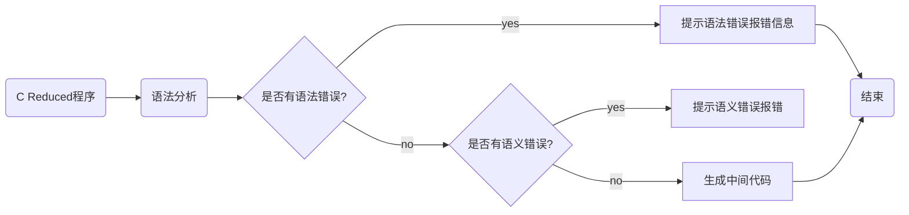
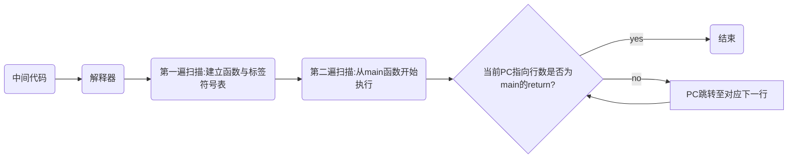

<div class="cover" style="page-break-after:always;font-family:方正公文仿宋;width:100%;height:100%;border:none;margin: 0 auto;text-align:center;">
    <div style="width:60%;margin: 0 auto;height:0;padding-bottom:10%;">
        </br>
        
    </div>
    </br></br></br></br></br>
    <div style="width:50%;margin: 0 auto;height:0;padding-bottom:40%;">
        
	</div>
    </br></br></br></br></br></br></br></br>
    <span style="font-family:华文黑体Bold;text-align:center;font-size:20pt;margin: 10pt auto;line-height:30pt;">编译原理大程实验报告</span>
    <p style="text-align:center;font-size:14pt;margin: 0 auto">C Reduced </p>
    </br>
    </br>
    <table style="border:none;text-align:center;width:72%;font-family:仿宋;font-size:14px; margin: 0 auto;">
    <tbody style="font-family:方正公文仿宋;font-size:12pt;">
    	<tr style="font-weight:normal;"> 
    		<td style="width:20%;text-align:right;">课程名称</td>
    		<td style="width:2%">：</td> 
    		<td style="width:40%;font-weight:normal;border-bottom: 1px solid;text-align:center;font-family:华文仿宋"> 编译原理</td>     </tr>
    	<tr style="font-weight:normal;"> 
    		<td style="width:20%;text-align:right;">学年学期</td>
    		<td style="width:2%">：</td> 
    		<td style="width:40%;font-weight:normal;border-bottom: 1px solid;text-align:center;font-family:华文仿宋"> 2022-2023学年春夏学期</td>     </tr>
        <tr style="font-weight:normal;"> 
    		<td style="width:20%;text-align:right;">学　　院</td>
    		<td style="width:%">：</td> 
    		<td style="width:40%;font-weight:normal;border-bottom: 1px solid;text-align:center;font-family:华文仿宋"> 计算机科学与技术</td>     </tr>
    	<tr style="font-weight:normal;"> 
    		<td style="width:20%;text-align:right;">授课教师</td>
    		<td style="width:2%">：</td> 
    		<td style="width:40%;font-weight:normal;border-bottom: 1px solid;text-align:center;font-family:华文仿宋">李  莹 </td>     </tr>
    	<tr style="font-weight:normal;"> 
    		<td style="width:20%;text-align:right;">小组成员</td>
    		<td style="width:2%">：</td> 
    		<td style="width:40%;font-weight:normal;border-bottom: 1px solid;text-align:center;font-family:华文仿宋"> 王启能  3200106262</td>     </tr>
        <tr style="font-weight:normal;"> 
    		<td style="width:20%;text-align:right;"></td>
    		<td style="width:2%"></td> 
    		<td style="width:40%;font-weight:normal;border-bottom: 1px solid;text-align:center;font-family:华文仿宋"> 刘心仪  3200106259</td>     </tr>
        <tr style="font-weight:normal;"> 
    		<td style="width:20%;text-align:right;"></td>
    		<td style="width:2%"></td> 
    		<td style="width:40%;font-weight:normal;border-bottom: 1px solid;text-align:center;font-family:华文仿宋"> 吴 晨  3200105434</td>     </tr>
    	<tr style="font-weight:normal;"> 
    		<td style="width:20%;text-align:right;">组　　别</td>
    		<td style="width:%">：</td> 
    		<td style="width:40%;font-weight:normal;border-bottom: 1px solid;text-align:center;font-family:华文仿宋"> 第22组</td>     </tr>
    	<tr style="font-weight:normal;"> 
    		<td style="width:20%;text-align:right;">日　　期</td>
    		<td style="width:2%">：</td> 
    		<td style="width:40%;font-weight:normal;border-bottom: 1px solid;text-align:center;font-family:华文仿宋">5/27/2023</td>     </tr>
    </tbody>              
    </table>
</div>

<!-- 注释语句：导出PDF时会在这里分页 -->

# 编译原理大程实验报告——`C Reduced`

## 序言

本次大程实验中，我们小组实现了一个类C语言`C Reduced`，该语言对应的语法以基础的C语言内容作为基础，并根据实际的使用场景做出了一定的修改。作为一种**图灵完备语言**，用户能够对该语言进行通过合理的逻辑设计以完成所有其余图灵完备语言设计出的程序。

### `C Reduced`语言特性

+ **支持的数据类型：**`int`, `float`, `char`, `bool`, `void`, `int*`, `char*`, `float*`, `bool*`, `struct`
+ **支持的基本语句：**`if`, `else`, `for`, `while`, `break`, `continue`, `return`
+ **支持的表达式类型：**`()`, `[]`, `sizeof`, 函数计算，结构体访问`.`，`+1`, `-1`，四则算数运算，模运算，逻辑运算，赋值运算
+ **所有支持的算数方式：**`+`, `-`, `*`, `/`, `%`, `+=`, `-=`, `*=`, `/=`, `%=`, `||`, `&&`, `!`, `+`, `-`, `=`, `.`
+ **支持的数组定义和访问：**普通数组定义方式与C语言完全一致，同时支持可变长度的数组定义，如`int a[m][n]`；数组的访问方式与C语言方式一致，如`a[i][j]`。
+ **指针的使用**：指针类型仅能作为数组的一种花名，支持使用`[]`进行访问。指针类型不支持加减乘除运算，不支持指针间赋值，不支持使用`*a`这种方式进行访问，不支持结构体的访问，不推荐将指针作为函数的返回值。
+ **类型转换：**支持`float`, `char`, `bool`向`int`转换，支持`int`, `char`向`float`转换，支持`int`向`char`转换，支持`int`, `float`, `char`向`bool`转换，其余一概不支持。
+ **输入和输出：**通过特别定义的`scanf`和`printf`实现，仅支持最多单个变量的输入或输出，`printf`支持常量的输出。
+ **常量识别：**可以识别八进制、十进制、十六进制整数，可以识别小数和科学表达式，可以之别`''`, `“”`包裹的字符或字符串
+ **函数的声明和定义：**支持将函数先声明再定义，并会检查声明与声明、声明与定义之间的类型是否一致。
+ **支持结构体定义：**支持结构体定义，支持相同域的结构体直接赋值，支持结构的域访问。
+ **作用域：**支持不同作用域之间变量的重命名，作用域以`{}`进行分割。

### 项目开发环境

+ Windows PowerShell
+ Language: `C++`
+ IDE/Editor: CLion / VSCode
+ Flex (Version 2.5.4)
+ GNU Bison (Version 2.4.1)
+ MinGW64 (`g++` Version 8.1.0)
+ C++ standard: `C++11`

### 运行方式

+ 在项目中进入`src/`目录，点击`scriptGen.bat`生成可执行文件
+ 点击`scriptRun.bat`对默认文件夹中的测试文件进行测试
+ 或者，可以在终端直接运行`output.exe filename`生成IR代码
+ 回到项目根目录，进入`interpreter/`，点击`scriptGen.bat`生成可执行文件
+ 在PowerShell中运行`test.bat`，以运行官方测试
+ 或者在终端运行`interpreter.exe irFileName`以运你想要的IR代码

### 小组分工

+ 王启能：NJUCFG重设计 & 语法/语义分析 & IR解释器 & 报告
+ 刘心仪：中间代码生成 & 测试 & 报告
+ 吴晨： 中间代码生成 & 测试 & 报告

## 词法分析

### Flex介绍

我们使⽤flex完成词法分析过程。 flex（快速词法分析产⽣生器器， fast lexical analyzer generator）是⼀种词法分析程序。它是lex的开放源代码版本，以BSD许可证发布，通常与GNU bison⼀同运作。

标准lex⽂件由三部分组成，分别是定义区、规则区和用户⼦过程区。在定义区，⽤户可以编写C语言中的声明语句，导⼊需要的头文件或声明变量。在规则区，⽤户需要编写以正则表达式和对应的动作的形式的代码。在用户⼦过程区，⽤户可以定义函数。它的一般格式如下：

```
{definitions}
%%
{rules}
%%
{subroutines}
```

### 语法树构建

**语法树**（Syntax tree），是源代码语法结构的⼀一种抽象表示。它以树状的形式表现编程语⾔言的语法结构，树上的每个节点都表示源代码中的⼀一种结构。  词法分析中，所有token都一定是语法树的叶子节点，因为token是整个语法分析中的最底层信息，它直接表示程序的所有实际token内容。

#### 语法树`Node`类

```c++
typedef struct TreeNode Node;
struct TreeNode {
public:
    // Node name
    std::string name;
    // Node type, define it is whether a leaf node or internal node
    NodeType nodeType;
    // program line num of this node
    int linenum;
    union {
        char strVal[32];// used for id, type, idptr
        int intVal; // intVal of this node
        float floatVal; // floatVal of this node
        char charVal;// charVal of this node
        bool boolVal;// boolVal of this node
        struct { int size; char val[64]; } glbStr; // const char* value
    };
    // number of children
    int childNum;
    // children ptrs
    struct TreeNode** children;
    // construction function
    TreeNode(std::string name, NodeType nodeType, int linenum, int childNum, TreeNode** children) {
        this->name = name;
        this->nodeType = nodeType;
        this->linenum = linenum;
        this->childNum = childNum;
        this->children = children;
        bool nullNode = true;
        for (int i = 0; i < this->childNum; i++)
            if ((this->children)[i]->nodeType != SYN_NULL)
                nullNode = false;
        if (nodeType == SYN_NOT_NULL && nullNode)
            this->nodeType = SYN_NULL;
    }
};
Node* createNode(std::string name, NodeType nodeType, int linenum, int childNum, Node** children) {
    return new Node(name, nodeType, linenum, childNum, children);
}
```

### Tokens

```
	INT -> /*Oct/Dec/Hex form digits*/
	FLOAT -> /*Real Number consists of digits and one decimal point*/
	ID -> /*A character string consisting of 52 upper- or lower-case alphabetic, 10 numeric and one underscore characters. Besides, an identifier must not start with a digit*/
	SEMI -> ;
	COMMA -> ,
	RELOP -> > | < | >= | <= | == | !=
	PLUS -> +
	MINUS -> -
	STAR -> *
	DIV -> /
	MOD -> %
	AND -> &&
	OR -> ||
	NOT -> !
	DOT -> .
	TYPE -> int | float | char | bool | void
	TYPEPTR ->  char* | int* | float* | bool*
	LP -> (
	RP -> )
	LB -> [
	RB -> ]
	LC -> {
	RC -> }
	ASSIGNOP -> =
	REASSIGNOP -> += | -= | /= | %=
	STRUCT -> struct
	RETURN -> return
	IF -> if
	ELSE -> else
	WHILE -> while
	FOR -> for
	BREAK -> break
	CONTINUE -> continue
	SIZEOF -> sizeof
	SCANF -> scanf
	PRITNF -> printf
```

### 正则表达式

| 名称    | 正则表达式                                                   |
| ------- | ------------------------------------------------------------ |
| CHAR    | `"\'"\\."\'"|"\'"[^\\']"\'"`                                 |
| SPACE   | `[ \t\r]+`                                                   |
| BOOL    | `"true"|"false"`                                             |
| STRING  | `"\""(\\.|[^"\\])*"\""`                                      |
| COMMENT | `"//"|"/*"`                                                  |
| INT     | `{0[0-7]+}|{0|[1-9][0-9]*}|{(0x|0X)[0-9a-fA-F]+}`            |
| FLOAT   | `(([0-9]*\.[0-9]+|[0-9]+\.)[eE][+-]?[0-9]+)|([0-9]+\.[0-9]+)` |
| ID      | `[_a-zA-Z]+([0-9]|[_a-zA-Z])*`                               |

### 词法分析具体实现

#### `C Reduced`关键字

```c
"struct"    { yylval = createNode("STRUCT", LEX_OTHER, yylineno, 0, NULL);
              return STRUCT; }
"return"    { yylval = createNode("RETURN", LEX_OTHER, yylineno, 0, NULL);
              return RETURN; }
"if"        { yylval = createNode("IF", LEX_OTHER, yylineno, 0, NULL); 
              return IF; }
"else"      { yylval = createNode("ELSE", LEX_OTHER, yylineno, 0, NULL);
              return ELSE; }
"for"       { yylval = createNode("FOR", LEX_OTHER, yylineno, 0, NULL);
              return FOR; }
"while"     { yylval = createNode("WHILE", LEX_OTHER, yylineno, 0, NULL);
              return WHILE; }
"break"     { yylval = createNode("BREAK", LEX_OTHER, yylineno, 0, NULL);
              return BREAK; }
"continue"  { yylval = createNode("CONTINUE", LEX_OTHER, yylineno, 0, NULL);
              return CONTINUE; }
"sizeof"    { yylval = createNode("SIZEOF", LEX_OTHER, yylineno, 0, NULL);
              return SIZEOF; }
"ptr"       { yylval = createNode("PTR", LEX_OTHER, yylineno, 0, NULL);
              return PTR; }
"scanf"     { yylval = createNode("SCANF", LEX_OTHER, yylineno, 0, NULL);
              return SCANF; }
"printf"    { yylval = createNode("PRINTF", LEX_OTHER, yylineno, 0, NULL);
              return PRINTF;}
{TYPE}      { yylval = createNode("TYPE", LEX_TYPE, yylineno, 0, NULL);
              strcpy(yylval->strVal, yytext);
              return TYPE; }
{TYPEPTR}   { yylval = createNode("TYPEPTR", LEX_PTR, yylineno, 0, NULL);
              strcpy(yylval->strVal, yytext);
              return TYPEPTR; }
```

#### `C Reduced`语言操作符

```C
","         { yylval = createNode("COMMA", LEX_OTHER, yylineno, 0, NULL);
              return COMMA; }
"."         { yylval = createNode("DOT", LEX_OTHER, yylineno, 0, NULL);
              return DOT; }
";"         { yylval = createNode("SEMI", LEX_OTHER, yylineno, 0, NULL);
              return SEMI; }
"("         { yylval = createNode("LP", LEX_OTHER, yylineno, 0, NULL);
              return LP; }
")"         { yylval = createNode("RP", LEX_OTHER, yylineno, 0, NULL);
              return RP; }
"["         { yylval = createNode("LB", LEX_OTHER, yylineno, 0, NULL);
              return LB; }
"]"         { yylval = createNode("RB", LEX_OTHER, yylineno, 0, NULL);
              return RB; }
"{"         { yylval = createNode("LC", LEX_OTHER, yylineno, 0, NULL);
              return LC; }
"}"         { yylval = createNode("RC", LEX_OTHER, yylineno, 0, NULL);
              return RC; }
{RELOP}     { yylval = createNode("RELOP", LEX_OTHER, yylineno, 0, NULL);
              strcpy(yylval->strVal, yytext);
              return RELOP; }
"="         { yylval = createNode("ASSIGNOP", LEX_OTHER, yylineno, 0, NULL);
              return ASSIGNOP; }
"!"         { yylval = createNode("NOT", LEX_OTHER, yylineno, 0, NULL);
              return NOT; }
"&&"        { yylval = createNode("AND", LEX_OTHER, yylineno, 0, NULL);
              return AND; }
"||"        { yylval = createNode("OR", LEX_OTHER, yylineno, 0, NULL);
              return OR; }
{REASSIGNOP} { yylval = createNode("REASSIGNOP", LEX_OTHER, yylineno, 0, NULL);
               return REASSIGNOP; }
"+"         { yylval = createNode("PLUS", LEX_OTHER, yylineno, 0, NULL);
              return PLUS; }
"-"         { yylval = createNode("MINUS", LEX_OTHER, yylineno, 0, NULL);
              return MINUS; }
"*"         { yylval = createNode("STAR", LEX_OTHER, yylineno, 0, NULL);
              return STAR; }
"/"         { yylval = createNode("DIV", LEX_OTHER, yylineno, 0, NULL);
              return DIV; }
"%"         { yylval = createNode("MOD", LEX_OTHER, yylineno, 0, NULL);
              return MOD;}
```

#### `C Reduced`常量串匹配

```C
{HEX}       { yylval = createNode("INT", LEX_INT, yylineno, 0, NULL);
              yylval->intVal = hexstrToi(yytext);
              return INT; }
{OCT}       { yylval = createNode("INT", LEX_INT, yylineno, 0, NULL);
              yylval->intVal = octstrToi(yytext);
              return INT; }
{DEC}       { yylval = createNode("INT", LEX_INT, yylineno, 0, NULL);
              yylval->intVal = atoi(yytext);
              return INT; }
{FLOAT}     { yylval = createNode("FLOAT", LEX_FLOAT, yylineno, 0, NULL);
              yylval->floatVal = atof(yytext);
              return FLOAT; }
{CHAR1}     { yylval = createNode("CHAR", LEX_CHAR, yylineno, 0, NULL);
              yylval->charVal = escape2char(yytext[2]); 
              return CHAR; }
{CHAR2}     { yylval = createNode("CHAR", LEX_CHAR, yylineno, 0, NULL);
              yylval->charVal = yytext[1];
              return CHAR; }
{BOOL}      { yylval = createNode("BOOL", LEX_BOOL, yylineno, 0, NULL);
              yylval->boolVal = str2bool(yytext);
              return BOOL; }
{STRING}    { yylval = createNode("STRING", LEX_STRING, yylineno, 0, NULL);
              std::string temp = "";
              for (int i = 1; i <= yyleng-2; i++) {
                if (yytext[i] == '\\') {
                    i++;
                    temp.push_back(escape2char(yytext[i]));
                } else {
                    temp.push_back(yytext[i]);
                }
              }
              yylval->glbStr.size = temp.size();
              strcpy(yylval->glbStr.val, temp.c_str());
              return STRING; }
{ID}        { yylval = createNode("ID", LEX_ID, yylineno, 0, NULL);
              strcpy(yylval->strVal, yytext);
```

#### `C Reduced`注释和其它token

```C
"\n"        { yycolumn = 1; }
{SPACE}     { }
              return ID; }
"//"        { char c = yyinput(); 
              while (c != '\n') c = yyinput(); }
"/*"        { char a = yyinput(); char b = yyinput();
              while (!(a == '*' && b == '/')) { a = b; b = yyinput(); } }
.           { printf("Error type A at Line %d: Mysterious characters \'%s\'\n", yylineno, 				yytext); lexError++; }
```

## 语法分析

### Yacc

我们使用Yacc作为我们的分析程序生成器，其输入是一个说明文件 `.y` ，并产生一个由分析程序的C源代码组成的输出文件，格式为：

```
{definitions}
%%
{rules}
%%
{subroutines}
```

### 语法分析的定义部分

其中，`package`函数表示将语法生成的子节点打包插入到被生成的`terminal`的儿子节点中。`%left`, `%right`, `%nonassoc`定义了对应token的结合性，优先级按照行数依次增高。

```C
%locations
%error-verbose
%{
    #include <stdarg.h>
    #include "lexical.cpp"
    Node* root = NULL;
    Node** package(int childNum, Node* child1, ...);
    void yyerror(const char* msg);
    int synError = 0;
%}

%token INT FLOAT CHAR BOOL STRING VOID ID SEMI COMMA ASSIGNOP RELOP 
%token PLUS MINUS STAR DIV MOD AND OR DOT NOT TYPE LP RP LB RB LC RC STRUCT RETURN IF ELSE WHILE
%token REASSIGNOP PTR FOR BREAK CONTINUE SIZEOF TYPEPTR SCANF PRINTF

%right ASSIGNOP REASSIGNOP
%left OR
%left AND
%left RELOP
%left PLUS MINUS
%left STAR DIV MOD
%right NOT SIZEOF
%left LP RP LB RB DOT

%nonassoc LOWER_THAN_ELSE
%nonassoc ELSE
%output "syntax.cpp"
```

### `C Reduced`的规则部分（CFG）

```c++
Program : ExtDefList                            
    ;
ExtDefList : ExtDef ExtDefList                  
    | /* empty */                               
    ;
ExtDef : Specifier ExtDecList SEMI              
    | Specifier SEMI                            
    | Specifier FunDec SEMI                     
    | Specifier FunDec CompSt                   
    | Specifier error SEMI                      
    | error SEMI                                
    | Specifier error                           
    ;
// modified to support global assignment
ExtDecList : ExtDec                             
    | ExtDec COMMA ExtDecList                   
    | ExtDec error COMMA ExtDecList             
    ;
// newly added
ExtDec : VarDec                             
    | VarDec ASSIGNOP Exp                       
    | error ASSIGNOP Exp                        
    ;
Specifier : TYPE                                
    | TYPEPTR                                   
    | StructSpecifier                           
    ;
StructSpecifier : STRUCT OptTag LC DefList RC   
    | STRUCT Tag                                
    | STRUCT error LC DefList RC                
    | STRUCT OptTag LC error RC                 
    | STRUCT OptTag LC error                    
    | STRUCT error                              
    ;
OptTag : ID                                     
    | /* empty */                               
    ;
Tag : ID                                        
    ;

VarDec : ID                                     
    | VarDec LB INT RB                          
    | VarDec LB ID RB                           
    | VarDec LB error RB                        
    | VarDec LB error                           
    ;
Scanf : SCANF LP STRING COMMA Exp RP SEMI       
    ;
Printf : PRINTF LP STRING COMMA Exp RP SEMI     
    | PRINTF LP STRING RP SEMI                  
    ;
FunDec : ID LP VarList RP                       
    | ID LP RP                                  
    | ID LP error RP                            
    | ID LP error                               
    ;
VarList : ParamDec COMMA VarList                
    | ParamDec                                  
    ;
ParamDec : Specifier VarDec                     
    ;

CompSt : LC StmtList RC                         
    ;
StmtList : Stmt StmtList                        
    | Def StmtList                              
    | /* empty */                               
    ;
Stmt : Exp SEMI                                 
    | CompSt                                    
    | Scanf                                     
    | Printf                                    
    | RETURN Exp SEMI                           
    | IF LP Exp RP Stmt %prec LOWER_THAN_ELSE   
    | IF LP Exp RP Stmt ELSE Stmt               
    | WHILE LP Exp RP Stmt                      
    | FOR LP Exp SEMI Exp SEMI Exp RP CompSt    
    | BREAK SEMI                                
    | CONTINUE SEMI                             
    | error SEMI                                
    | IF LP error RP Stmt %prec LOWER_THAN_ELSE 
    | IF LP Exp RP error ELSE Stmt              
    | IF LP error RP ELSE Stmt                  
    | error LP Exp RP Stmt                      
    ;
DefList : Def DefList                           
    | /* empty */                               
    ;
Def : Specifier DecList SEMI                    
    ;
DecList : Dec                                   
    | Dec COMMA DecList                         
    | Dec error DecList                         
    ;
Dec : VarDec                                    
    | VarDec ASSIGNOP Exp                       
    | error ASSIGNOP Exp                        
    ;
Exp : Exp ASSIGNOP Exp                          
    | Exp REASSIGNOP Exp                        
    | Exp AND Exp                               
    | Exp OR Exp                                
    | Exp RELOP Exp                             
    | Exp PLUS Exp                              
    | Exp MINUS Exp                             
    | Exp STAR Exp                              
    | Exp DIV Exp                               
    | Exp MOD Exp                               
    | SIZEOF LP Exp RP                          
    | SIZEOF LP TYPE RP                         
    | LP Exp RP                                 
    | MINUS Exp                                 
    | NOT Exp                                   
    | ID LP Args RP                             
    | ID LP RP                                  
    | Exp LB Exp RB                             
    | Exp DOT ID                                
    | LP TYPE RP Exp                            
    | ID                                        
    | PTR ID                                    
    | INT                                       
    | FLOAT                                     
    | CHAR                                      
    | BOOL                                      
    | STRING                                    
    | VOID                                      
    | Exp ASSIGNOP error                        
    | Exp REASSIGNOP error                      
    | Exp AND error                             
    | Exp OR error                              
    | Exp RELOP error                           
    | Exp PLUS error                            
    | Exp MINUS error                           
    | Exp STAR error                            
    | Exp DIV error                             
    | Exp MOD error                                                                           
    | ID LP error RP                            
    | Exp LB error RB                           
    | LP error RP Exp                           
    | LP TYPE RP error                          
    | LP error RP error                         
    ;
Args : Exp COMMA Args                           
    | Exp                                       
    ;
```

#### CFG高级定义层次

```C++
Program : ExtDefList                            
    ;
ExtDefList : ExtDef ExtDefList                  
    | /* empty */                               
    ;
ExtDef : Specifier ExtDecList SEMI              
    | Specifier SEMI                            
    | Specifier FunDec SEMI                     
    | Specifier FunDec CompSt                   
    | Specifier error SEMI                      
    | error SEMI                                
    | Specifier error                           
    ;
// modified to support global assignment
ExtDecList : ExtDec                             
    | ExtDec COMMA ExtDecList                   
    | ExtDec error COMMA ExtDecList             
    ;
// newly added
ExtDec : VarDec                             
    | VarDec ASSIGNOP Exp                       
    | error ASSIGNOP Exp                        
    ;
```

这一部分的产生式包含了`C Reduced`语言中的所有高层（全局变量以及函数定义）语法：

1. 语法单元`Program`是初始语法单元，表示整个程序。
2. 每个`Program`可以产生一个`ExtDefList`，这里的`ExtDefList`表示零个或多个`ExtDef` 。
3. 每个ExtDef表示一个全局变量、结构体或函数的定义。其中：
   1. 产生式`ExtDef -> Specifier ExtDecList SEMI`表示全局变量的定义，例如`int global1, global2;`。其中`Specifier`表示类型， `ExtDecList`表示零个或多个对一个变量的定义`ExtDec`。`ExtDec`分为可以被赋初值和直接声明两种类型。
   2. 产生式`ExtDef -> Specifier SEMI`专门为结构体的定义而准备，例如`struct {…};`。这条产生式也会允许出现像`int;`这样没有意义的语句，但实际上在标准C语言中这样的语句也是合法的。
   3. 产生式`ExtDef -> Specifier FunDec CompSt`表示函数的定义，其中`Specifier`是返回类型， `FunDec`是函数头， `CompSt`表示函数体。

#### 关于类型`Specifier`

```C++
Specifier : TYPE                                
    | TYPEPTR                                   
    | StructSpecifier                           
    ;
StructSpecifier : STRUCT OptTag LC DefList RC   
    | STRUCT Tag                                
    | STRUCT error LC DefList RC                
    | STRUCT OptTag LC error RC                 
    | STRUCT OptTag LC error                    
    | STRUCT error                              
    ;
OptTag : ID                                     
    | /* empty */                               
    ;
Tag : ID                                        
    ;
```

这一部分的产生式主要与变量的类型有关：

1. `Specifier`是类型描述符，它有两种取值，一种是`Specifier -> TYPE | TYPEPTR`， 直接变成基本类型或者指针类型，另一种是`Specifier -> StructSpecifier`，变成结构体类型。  
2. 对于结构体类型来说：  
   1. 产生式`StructSpecifier -> STRUCT OptTag LC DefList RC`：这是定义结构体的基本格式，例如`struct Complex { int real, image; }`。其中`OptTag`可有可无。
   2. 产生式`StructSpecifier → STRUCT Tag`：如果之前已经定义过某个结构体，比如`struct Complex {…}`，那么之后可以直接使用该结构体来定义变量，例如`struct Complex a, b`;，而不需要重新定义这个结构体。

#### 关于变量的定义和函数的定义

```C++
VarDec : ID                                     
    | VarDec LB INT RB                          
    | VarDec LB ID RB                           
    | VarDec LB error RB                        
    | VarDec LB error                           
    ;
FunDec : ID LP VarList RP                       
    | ID LP RP                                  
    | ID LP error RP                            
    | ID LP error                               
    ;
VarList : ParamDec COMMA VarList                
    | ParamDec                                  
    ;
ParamDec : Specifier VarDec                     
    ;

```

这一部分的产生式主要与变量和函数的定义有关：

1. `VarDec`表示对一个变量的定义。 该变量可以是一个标识符（例如`int a`中的`a`），也可以是一个标识符后面跟着若干对方括号括起来的数字（例如`int a[10][2]`中的`a[10][2]`，这种情况下`a`是一个数组）。  
2. `FunDec`表示对一个函数头的定义。它包括一个表示函数名的标识符以及由一对圆括号括起来的一个形参列表，该列表由`VarList`表示（也可以为空）。 `VarList`包括一个或多个`ParamDec`，其中每个`ParamDec`都是对一个形参的定义，该定义由类型描述符`Specifier`和变量定义`VarDec`组成。 例如一个完整的函数头为： `foo(int x, float y[10])`。  

#### 关于程序的语句部分

```c++
CompSt : LC StmtList RC                         
    ;
StmtList : Stmt StmtList                        
    | Def StmtList                              
    | /* empty */                               
    ;
Stmt : Exp SEMI                                 
    | CompSt                                    
    | Scanf                                     
    | Printf                                    
    | RETURN Exp SEMI                           
    | IF LP Exp RP Stmt %prec LOWER_THAN_ELSE   
    | IF LP Exp RP Stmt ELSE Stmt               
    | WHILE LP Exp RP Stmt                      
    | FOR LP Exp SEMI Exp SEMI Exp RP CompSt    
    | BREAK SEMI                                
    | CONTINUE SEMI                             
    | error SEMI                                
    | IF LP error RP Stmt %prec LOWER_THAN_ELSE 
    | IF LP Exp RP error ELSE Stmt              
    | IF LP error RP ELSE Stmt                  
    | error LP Exp RP Stmt                      
    ;
Scanf : SCANF LP STRING COMMA Exp RP SEMI       
    ;
Printf : PRINTF LP STRING COMMA Exp RP SEMI     
    | PRINTF LP STRING RP SEMI                  
    ;
```

这一部分的产生式主要与语句有关：

1. `CompSt`表示一个由一对花括号括起来的语句块。 该语句块内部先是一系列的变量定义`DefList`，然后是一系列的语句`StmtList`。可以发现，对`CompSt`这样的定义， 是不允许在程序的任意位置定义变量的，必须在每一个语句块的开头才可以定义。  
2. `StmtList`就是零个或多个`Stmt`的组合，或者是变量的定义语句。每个`Stmt`都表示一条语句：
   1. 可以是一个在末尾添了分号的表达式`Exp SEMI `
   2. 可以是另一个语句块`CompSt`
   3. 可以是输入语句`Scanf`
   4. 可以是输出语句`Printf`
   5. 可以是一条返回语句`RETURN Exp SEMI`  
   6. 可以是一条if语句`IF LP Exp RP Stmt`
   7. 可以是一条if-else语句`IF LP Exp RP Stmt ELSE Stmt`
   8. 可以是一条while语句`WHILE LP Exp RP Stmt`
   9. 可以是一条for语句`FOR LP Exp SEMI Exp SEMI Exp RP CompSt`
   10. 可以是一条break语句`BREAK SEMI`
   11. 可以是一条continue语句`CONTINUE SEMI`

#### 本地定义

```C++
DefList : Def DefList                           
    | /* empty */                               
    ;
Def : Specifier DecList SEMI                    
    ;
DecList : Dec                                   
    | Dec COMMA DecList                         
    | Dec error DecList                         
    ;
Dec : VarDec                                    
    | VarDec ASSIGNOP Exp                       
    | error ASSIGNOP Exp                        
    ;
```

这一部分的产生式主要与局部变量的定义有关：

1. `DefList`这个语法单元前面曾出现在`CompSt`以及`StructSpecifier`产生式的右边，它就是一串像`int a; float b, c; int d[10];`这样的变量定义。一个`DefList`可以由零个或者多个Def组成。  
2. 每个`Def`就是一条变量定义，它包括一个类型描述符`Specifier`以及一个`DecList`，例如`int a, b, c;`。 由于`DecList`中的每个`Dec`又可以变成`VarDec ASSIGNOP Exp`，这允许我们对局部变量在定义时进行初始化，例如`int a = 5;`。  

#### 表达式

```C++
Exp : Exp ASSIGNOP Exp                          
    | Exp REASSIGNOP Exp                        
    | Exp AND Exp                               
    | Exp OR Exp                                
    | Exp RELOP Exp                             
    | Exp PLUS Exp                              
    | Exp MINUS Exp                             
    | Exp STAR Exp                              
    | Exp DIV Exp                               
    | Exp MOD Exp                               
    | SIZEOF LP Exp RP                          
    | SIZEOF LP TYPE RP                         
    | LP Exp RP                                 
    | MINUS Exp                                 
    | NOT Exp                                   
    | ID LP Args RP                             
    | ID LP RP                                  
    | Exp LB Exp RB                             
    | Exp DOT ID                                
    | LP TYPE RP Exp                            
    | ID                                        
    | PTR ID                                    
    | INT                                       
    | FLOAT                                     
    | CHAR                                      
    | BOOL                                      
    | STRING                                    
    | VOID                                      
    | Exp ASSIGNOP error                        
    | Exp REASSIGNOP error                      
    | Exp AND error                             
    | Exp OR error                              
    | Exp RELOP error                           
    | Exp PLUS error                            
    | Exp MINUS error                           
    | Exp STAR error                            
    | Exp DIV error                             
    | Exp MOD error                                                              
    | ID LP error RP                            
    | Exp LB error RB                           
    | LP error RP Exp                           
    | LP TYPE RP error                          
    | LP error RP error                         
    ;
Args : Exp COMMA Args                           
    | Exp                                       
    ;
```

这一部分的产生式主要与表达式有关：

1. 表达式主要可以被表示为一下几种形式：
   1. 包含二元运算符的表达式：赋值表达式 `Exp ASSIGNOP Exp | Exp REASSIGNOP Exp `、逻辑与`Exp AND Exp`、逻辑或`Exp OR Exp`、关系表达式`Exp RELOP Exp`以及四则运算表达式`Exp PLUS Exp`等。
   2. 包含一元运算符的表达式：括号表达式`LP Exp RP`、取负`MINUS Exp`以及逻辑非`NOT Exp`
   3. 不包含运算符但又比较特殊的表达式：函数调用表达式（带参数的`ID LP Args RP`以及不带参数的`ID LP RP`）、数组访问表达式`Exp LB Exp RB`以及结构体访问表达式`Exp DOT ID`
   4. 计算变量大小或数据类型大小的表达式`SIZEOF LP Exp RP | SIZEOF LP TYPE RP `
   5. 最基本的表达式：整型常数`INT`、浮点型常数`FLOAT`，普通变量`ID`，常量字符`CHAR`，常量字符串`STRING`，常量布尔值`BOOL`
2. 语法单元`Args`表示实参列表，每个实参都可以变成一个表达式`Exp`  
3. 由于表达式中可以包含各种各样的运算符，为了消除潜在的二义性问题，我们需要给出这些运算符的优先级以及结合性，具体优先级和结合性请参考[语法分析的定义部分](#语法分析的定义部分)。

## 语义分析

## 中间代码生成

## 解释器

**解释器**（Interpreter）是一种可执行程序，它能够将其它语言按行进行直接转译运行。在本项目中，我们小组选择C++语言作为解释器的设计语言，翻译的目标语言是我们自行设计的中间代码。中间代码生成的整个执行流程如下



解释器执行流程如下



### 解释器工作流程介绍

考虑到中间代码的设计中，尽管其中的技术细节与高级语言十分相像，但整体的设计流程则与汇编语言更为贴切。因此，我们也会自然想到利用汇编语言中常见的执行设计思想即可。注意到，整个中间代码所有的变量是没有作用域的概念的，它们一旦被定义、被计算，均为全局可见。

#### 符号表

**符号表**就是汇编语言执行中会动态维护的一个表单，它被用于查询标签所在的PC值。这里与普通汇编语言采用的符号表不同的是，汇编语言一般只能使用相应硬件架构的有限个数的寄存器，而中间语言定义的变量则有无数个。这里为了解释器设计的简便，我们将所有的变量名称全部加入到符号表中进行维护。不同的是，我们符号表中类似于函数名和条件跳转标签是采用静态的维护过程，它们是在第一轮扫描中得以建立，并维持不变；而变量名则是在第二轮扫描（也即程序正式执行）动态建立，也即变量是在程序正式执行中得以建立的，它们内部的值也会根据相应的语句进行变动更新。

其对应的数据类型为`unordered_map`，定义如下

```C++
std::unordered_map<std::string, Symbol> symbolTable;
```

#### 程序类

程序类`Program_`是用来维护整个中间代码输入的关键类，它包括`PC`和`rawProgram`两个成员变量。`PC`表示程序计数器，功能是指向当前执行的语句在中间代码的相对位置，其模拟了ISA中的PC寄存器功能；`rawProgram`则是用来存储整个中间代码的变量，存储方式为按行存储。

它的定义如下
```C++
class Program_ {
public:
    int PC; // Program Counter
    vector<string> rawProgram; // whole program
    Program_(): PC(0) {}
};
```

#### 符号类型定义

符号类`Symbol_`定义表示一个符号所具有的基本信息，一个符号可以是一个`function`，可以是一个`label`，也可以是一个`variable`。因此，`symbol_`类所具备的定义如下所示

```c++
class Symbol_ {
public:
    SymbolType type; // 符号类型
    int lineno; // 符号所在行
    union {
        Function func; // 当前符号是函数
        int id; // 当前符号是一个Label，Label编号为id
        Var var; // 当前符号是一个变量
    };
};
```

#### 变量类定义

变量类`Var_`表示一个变量所具备的基本信息，它的定义如下

```C++
class Var_ {
public:
    string name; // 变量名称
    DataType type; // 变量对应的数据类型
    int size; // 如果是指针，则它对应的数组大小
    union {
        int iVal; // 整数
        float fVal; // 浮点数
        char cVal; // 字符
        bool bVal; // 布尔数
        void* ptr; // 指针
        Array arr; // 数组指针
    };
    // 拷贝构造
    Var_(const Var_& other) : name(other.name), type(other.type), size(other.size) {
        switch (type) {
            case INT_TYPE:
                iVal = other.iVal;
                break;
            case CHAR_TYPE:
                cVal = other.cVal;
                break;
            case FLOAT_TYPE:
                fVal = other.fVal;
                break;
            case PTR_INT_TYPE: {
                int *tmp = new int[size];
                memcpy(tmp, other.ptr, sizeof(int) * size);
                ptr = (void *) tmp;
                break;
            }
            case PTR_CHAR_TYPE: {
                char* tmp = new char[size];
                memcpy(tmp, other.ptr, sizeof(char)*size);
                ptr = (void*) tmp;
                break;
            }
            case PTR_FLOAT_TYPE: {
                float* tmp = new float[size];
                memcpy(tmp, other.ptr, sizeof(float)*size);
                ptr = (void*) tmp;
                break;
            }
            case ARRAY:
                arr = new Array_(*other.arr);
                break;
        }
    }
    // 默认构造
    Var_(){}
};
```

#### 数组类定义

数组类`Array_`定义是关于`Var_`的定义补充，表示一个变量如果是普通数组类时，所应该具备的基本信息，具体定义如下

```C++
class Array_ {
public:
    DataType type; // 数组基本元素的数据类型
    vector<int> size; // 数组各个维度的大小
    int* iarr; // 整数数组
    char* carr; // 字符数组
    float* farr; // 浮点数数组
    // 拷贝构造
    Array_(const Array_ &other) : type(other.type), size(other.size) {
        int len = 1;
        for (auto it: size) len *= len;
        if (other.type == INT_TYPE) iarr = other.iarr;
        else if (other.type == CHAR_TYPE) carr = other.carr;
        else if (other.type == FLOAT_TYPE) farr = other.farr;
    }
    // 普通构造
    Array_(){iarr = nullptr; carr = nullptr; farr = nullptr;}
};
```

#### 函数类定义

函数类`Function_`定义表示一个函数所具备的基本信息。考虑到中间代码的函数表示与诸如`C Reduced`的C-like语言中的函数定义不同，中间代码所谓的**函数**概念更多起到一个标签的作用，主要声明了函数入口，声明了函数传入的参数内容。

它的定义如下

```C++
class Function_ {
public:
    string name; // 函数名称
    ArgList head; // 参数列表头
    Function_() {head = nullptr;} // 默认构造
};
```

#### 参数列表类

参数列表类`ArgList_`定义表示一个函数在声明或者调用时的传入参数信息，数据结构为链表形式，它的定义如下

```C++
class ArgList_ {
public:
    bool isPassing; // 是否为传入参数，deprecated
    Var var; // 对应的变量指针
    ArgList nextVar; // 下一个变量
    // 构造函数
    ArgList_() {var = nullptr; nextVar = nullptr;}
};
```

#### 函数状态类

函数状态`FunctionState_`类是一个相当重要的类，它的设计意义在于，一个函数在调用另一个函数的时候，由于所有变量都是全局可见的，因此变量在其它函数的调用中如果发生值的重定义、值的更新，该变量会被覆盖，因而返回至调用之前所在的函数中时，该值便失去了原有的信息。这个问题在函数的**递归调用**（自调用）中相当常见。

函数状态类的设计初衷有两个：1. 解决变量覆盖的问题；2. 解决函数调用结束之后返回原函数的问题。这里注意，程序的入口函数`main`是禁止被任何函数调用的，包括`main`函数本身。

函数状态类的定义如下所示

```C++
class FunctionState_ {
public:
    int PC; // 当前的PC值
    string funcName; // 跳转前的函数名
    VarList head; // 跳转前函数中已经被定义的变量
    Var valToReturn; // 将要返回的变量，如果没有则为nullptr
    int index; // 如果是数组且要赋给具体值，则记录index
    // 无要返回对象的构造函数
    FunctionState_(string name, int PC, VarList head) {
        this->funcName = std::move(name);
        this->PC = PC;
        this->head = head;
        this->valToReturn = nullptr;
        this->index = -1;
    }
    // 有要返回对象的构造函数
    FunctionState_(string name, int PC, VarList head, Var val, int index) {
        this->funcName = std::move(name);
        this->PC = PC;
        this->head = head;
        this->valToReturn = val;
        this->index = index;
    }
    // 普通构造函数
    FunctionState_() {
        PC = 0;
        funcName = "";
        head = nullptr;
        index = 0;
    }
};
```

#### 变量列表类

变量列表类`VarList_`定义了一连串变量内容，其功能在于为`FunctionState_`类提供函数调用前变量的状态信息。它的定义如下

```C++
class VarList_ {
public:
    Var val; // 当前变量
    VarList nextVar; // 下一个变量
public:
    VarList_() : nextVar(nullptr), val(nullptr) {}
};
```

#### 函数调用栈

函数调用栈是表示函数调用之间的关系，考虑到函数调用结束之后会立即返回调用之前的上一层函数之中，因此我们采用栈的数据机构形式来维护函数调用之间的状态，从而确保变量之间运行的正确性。它的定义如下

```C++
stack<FunctionState> funcStates; /*NOLINT*/
```

#### 当前函数已经定义的变量列表

主要功能为维护当前函数已经定义的变量列表，所有信息应该为最新状态，定义如下

```C++
// 建立当前函数已经定义的变量列表，Head表示头，List表示tail
VarList curFuncVarList = nullptr, curFuncVarHead = nullptr;
```

### 解释器模块具体介绍

#### 解释器的入口函数

解释器从终端中获取要运行的中间代码的路径，首先运行第一轮以建立静态标签信息，之后运行第二轮，以正式运行中间代码。内容如下

```C++
int main(int argc, char* argv[]) {
    if (argc < 2) {
        cerr << "Usage: " << argv[0] << "filename\n";
        return 1;
    }
    ifstream file(argv[1]);
    string line;
    while (getline(file, line))
        p->rawProgram.push_back(line);
    file.close();
    firstRun();
    initRun();
    return 0;
}
```

#### 第一轮运行

主要是读入所有的LABEL和所有的函数名，便于后续的跳转或函数的调用。它的定义框架如下

```C++
void firstRun() {
    bool inFunc = false;
    for (int i = 0; i < p->rawProgram.size(); i++) {
        stringstream ss(p->rawProgram[i]);
        string token;
        Symbol sym = nullptr;
        ss >> token;
        if (token == "FUNCTION") {
            ...
            while (token != ":") {
                if (token == "PARAM") {
                    ...
                }
                ...
            }
            insertSymbol(sym, sym->func->name);
        } else if (token == "LABEL") {
            ...
            insertSymbol(sym, "LABEL" + to_string(sym->id));
        } else if (token == "RETURN") {
            inFunc = false;
        } else if (isDef(token) && !inFunc && (i+1 >= p->rawProgram.size() || p->rawProgram[i+1] == "")) varDec(token, ss);
    }
}
```

#### 正式运行程序

开始正式运行程序，将`PC`初始化为`main`函数所在的下一行函数，并逐行执行代码，它的框架如下

```C++
void initRun() {
    Symbol sym = symbolTable.find("main")->second;
    p->PC = sym->lineno + 1;
    string curLine = p->rawProgram[p->PC];
    while (!(runCurLine(curLine) == "RETURN" && activeFuncName == "main" && p->rawProgram[p->PC][2] == 'T')) {
        curLine = p->rawProgram[p->PC];
    }
}
```

当程序执行到`main`函数中的`return`语句时，表明程序完全执行完毕，因此结束迭代。

#### 运行当前`PC`指向的内容

根据该行读取到的第一个token决定解释器的行为，在我们设计的中间代码中，存在有以下几种情况

1. 该行为空行，将`PC`+1即可
2. 该行为定义新变量
3. 该行为读入变量值
4. 该行为写变量或写常量
5. 该行为条件跳转
6. 该行为直接函数调用
7. 该行为如`FUNCTION`, `LABEL`, `SIZEOF`等直接执行的无意义的行为
8. 该行为无条件跳转指令
9. 该行为返回指令
10. 该行为一般变量计算

这个模块的定义如下

```C++
string runCurLine(string line) {
    stringstream ss(line);
    string token;
    if(!(ss >> token)) {
        ...
    }
    else if (isDef(token)) {
        varDec(token, ss);
    }
    else if (token == "READ") {
        ...
        read(token, id);
    } else if (token == "WRITE") {
       ...
    } else if (token == "IF") {
        IF(line);
    } else if (token == "CALL") {
        ...
        callFunction(line);
    } else if (token == "SIZEOF" || token == "LABEL") {
        p->PC += 1;
    } else if (token == "GOTO" ) {
        PCgoto(line);
    } else if (token == "RETURN") {
        ...
        returnFunc(line);
    } else {
        ...
        calcNormalExp(token, rest);
    }

    return token;
}
```

#### 变量声明

变量声明模块中，分为直接声明和赋值声明两种情况，一般声明之后，需要将新声明的变量插入到符号表中。这个模块的实现框架如下

```C++
void varDec(string type, stringstream &ss) {
    auto sym = new Symbol_;
    sym->lineno = p->PC;
    sym->type = VAR;
    string id;
    string token;
    ss >> id;
    if (!(ss>>token))sym->var = createVar(type, id);
    else {
        getline(ss, token);
        token.erase(0, 1);
        sym->var = createVar(type, id, token);
    }

    insertSymbol(sym, sym->var->name);
    p->PC += 1;
}
```

#### 读入模块

该模块会根据提供的数据类型提示，完成对指定的变量输入，输入采用标准输入输出，它的框架如下

```C++
void read(const string& type, string id) {
    ...
    if (type == "INT") {
        ...
    } else if (type == "CHAR") {
        ...
    } else if (type == "FLOAT") {
        ...
    } else if (type == "CHAR*") {
        ...
    }
    p->PC += 1;
}
```

#### 写模块

该模块会根据当前语句的内容，要么根据提供的数据类型将变量写出，要么是直接将常量直接写出，这个模块的具体定义如下

```C++
void write(const string& type, string id) {
    ...
    if (type == "INT") {
        Symbol sym = symbolTable[id];
        if (isPtr)
            printf("%d", ((int*)var->ptr)[idx]);
        else if (isArray)
            printf("%d", sym->var->arr->iarr[idx]);
        else printf("%d", sym->var->iVal);
    } else if (type == "CHAR") {
        Symbol sym = symbolTable[id];
        if (isArray)
            printf("%c", sym->var->arr->carr[idx]);
        else printf("%c", sym->var->cVal);
    } else if (type == "FLOAT") {
        Symbol sym = symbolTable[id];
        if (isArray)
            printf("%.1f", sym->var->arr->farr[idx]);
        else printf("%.1f", sym->var->fVal);
    } else if (type == "CHAR*") {
        Symbol sym = symbolTable[id];
        string tmp = (char*)sym->var->ptr;
        printf("%s", (char*) sym->var->ptr);
    } else if (type == "BOOL") {
        Symbol sym = symbolTable[id];
        printf("%d", sym->var->bVal);
    }
    p->PC += 1;
}
void write(string value) {
    if (value[0] == '\'')
        printf("%c", convertChar(value));
    else if (value[0] == '\"')
        printf("%s", convertString(value).c_str());
    else if (value.find('.') != string::npos)
        printf("%.1f", atof(value.c_str()));
    else printf("%d", atoi(value.c_str()));
    p->PC += 1;
}
```

#### 条件跳转模块

条件跳转是程序执行的重要组成部分，它在高级语言中的表示原型可以是if，可以是while，可以是for等。条件跳转的处理思想就是满足给定的条件时，则直接跳转到给定的标签所在的行数+1，它的实现步骤分为两步：第一步确定提供的逻辑表达式是否为真；第二步，根据第一步的值确定是否要进行跳转。

逻辑表达式可以是如下形式

1. `Exp Relop Exp`
2. `Exp`
3. `Exp -> NOT Exp`

该模块的内容如下

```C++
void IF(string line) {
    ...
    if (line[0] == '!') {
        rv1 = true;
        line.erase(0, 1);
    }
    if (line[0] == '\'') {
        ch = matchChar(line);
        ...
    } else {
        ...
        if (token == "true"){
            r1 = true;
        } else if (token == "false") {
            r1 = false;
        } else if (token[0] == '-' || (token[0] >= '0' && token[0] <= '9')) {
           ...
        } else {
            ...
            isPtr1 = v1->type == PTR_FLOAT_TYPE || v1->type == PTR_CHAR_TYPE || v1->type == PTR_INT_TYPE;
            if (isPtr1) {
                idx1 = calcPtrIndex(token);
                ...
            } else if (isArr1) {
                idx1 = calcArraySize(token, v1->arr);
                ...
            } else {
                if (v1->type == INT_TYPE) r1 = v1->iVal;
                else if (v1->type == CHAR_TYPE) r1 = v1->cVal;
                else if (v1->type == BOOL_TYPE) r1 = v1->bVal;
                else if (v1->type == FLOAT_TYPE) {
                    isFloat1 = true;
                    rf1 = v1->fVal;
                }
            }
        }
    }
    ...
    if (isRelop(token)) {
        relop = token;
        if (line[0] == '!') {
            rv2 = true;
            line.erase(0, 1);
        }
        if (line[0] == '\'') {
            ch = matchChar(line);
            r2 = ch;
        } else {
            ...
            if (token == "true"){
                r2 = true;
            } else if (token == "false") {
                r2 = false;
            } else if (token[0] == '-' || (token[0] >= '0' && token[0] <= '9')) {
                ...
            } else {
                ...
                if (isPtr2) {
                    idx2 = calcPtrIndex(token);
                    ...
                } else if (isArr2) {
                    idx2 = calcArraySize(token, v2->arr);
                    ...
                } else {
                    if (v2->type == INT_TYPE) r2 = v2->iVal;
                    else if (v2->type == CHAR_TYPE) r2 = v2->cVal;
                    else if (v2->type == BOOL_TYPE) r2 = v2->bVal;
                    else if (v2->type == FLOAT_TYPE) {
                        isFloat2 = true;
                        rf2 = v2->fVal;
                    }
                }
            }
        }
        ...
        if (res) PCgoto(line);
        else p->PC += 1;
    } else {
        ...
        if (res) PCgoto(line);
        else p->PC += 1;
    }
}
```

#### 函数调用

这里是处理函数调用的模块。该模块主要处理以下事情

1. 构建当前函数的变量定义列表，构建时采用深度拷贝的形式，以便该变量（所有访问均通过指针，而非直接调用对象）所指向对象内部信息发生变化时，不会覆盖原先的内容
2. 记录当前`PC`值和函数名称
3. 记录是否有返回值，如果有，则记录对应的`Var`指针
4. 创建当前函数状态`FunctionState`，并压入函数调用栈之中
5. 将传入值按照函数参数列表依次赋值
6. `PC`跳转至新函数所在行数+1
7. 将当前函数名称更换为调用函数名称

该模块内容定义如下

```C++
void callFunction(string line, bool assign=false, int index=-1, Var val=nullptr) {
    ...
    FunctionState tmp = assign ? new FunctionState_(activeFuncName, p->PC+1, pushedVarList, val, index) : new FunctionState_(activeFuncName, p->PC+1, pushedVarList);
    funcStates.push(tmp);
    activeFuncName = funcName;
    while (ss >> token && curArg != nullptr) {
        ...
        assignArg(realArg, temp, realArg->name);
        ...
        curArg = curArg->nextVar;
    }
    p->PC = funcLine;
}
```

#### 无条件跳转

遇到GOTO命令时，跳转到对应的LABEL所在的下一行位置。

该模块的定义如下

```C++
void PCgoto(const string& line) {
    string token;
    stringstream s1(line);
    int id = 0;
    while (s1 >> token) {
        if (token != "GOTO" && token != "LABEL") {
            id = atoi(token.c_str());
            break;
        }
    }
    string label = "LABEL" + to_string(id);
    Symbol sym = symbolTable[label];
    p->PC = sym->lineno;
}
```

#### 函数返回指令

遇到返回命令，两种可能，一种可能是返回值不用赋值给其它变量，另一种是返回值要求赋值给其它变量。遇到返回指令时，程序的执行流程如下：

1. 获取返回值，以`Var`形式暂存
2. 从函数调用栈pop出调用前的函数状态
3. 根据此前函数状态，将里面的变量列表依次恢复，恢复当前函数名，恢复之前保存的`PC`值
4. 如有必要，将返回值赋值给对应的变量

该模块的实现框架如下：

```C++
void returnFunc(string line) {
    Var res = new Var_;
    ...
    if (funcStates.empty()) return;
    FunctionState prevState = funcStates.top();
    funcStates.pop();
    restorePrevState(prevState);
    if (prevState->valToReturn != nullptr) {
        Var tmp = prevState->valToReturn;
        string name = tmp->name;
        int index = prevState->index;
        if (index == -1) {
            res->name = name;
            symbolTable[name]->var = res;
            delete prevState->valToReturn;
        } else {
            ...
        }
    }
}
```

#### 计算有赋值的表达式语句

该模块主要功能是完成变量的赋值和更新。它会遇到的情况如下所示：

1. `Exp = Exp`
2. `Exp = EXP op Exp`
3. `Exp = SIZEOF Exp`
4. `Exp = SIZEOF TYPE`

当然，这些表达式自然会遇到**类型的强制转换**，**数组结构的访问**，**指针对数据结构的访问**这三种复杂的情况，但是这些具体的实现较为繁琐但无过多技术含量，考虑到篇幅限制，这里就不会将其展开。该模块的框架代码如下

```C++
void calcNormalExp(string token, const string& line) {
    ...
    if (tokens[1] == "=") {
        if ((test = tokens[2][0]) == '\"' || test == '\'') {
           ...
            if (test == '\"') {
                str = convertString(str);
                char *temp = (char *) malloc(sizeof(char) * (str.size() + 1));
                strcpy(temp, str.c_str());
                val->ptr = (void *) temp;
            } else {
                test = convertChar(str);
                ...
                } else if (isArr1) {
                    int index = calcPtrIndex(tokens[0]);
                    char* s = (char*)val->ptr;
                    s[index] = test;
                } else val->cVal = test;
            }
        } else {
            int idx = -1;
            if (isPtr)
                idx = calcPtrIndex(tokens[0]);
            else if (isArr1)
                idx = calcArraySize(tokens[0], val->arr);
            if (tokens.size() == 3) {
                bool isArr2 = isArr(tokens[2]);
                Var aVal = getVar(tokens[2]);
                if (aVal == nullptr) {
                    if (tokens[2] == "true")
                        assignValue(val, true);
                    else if (tokens[2] == "false")
                        assignValue(val, false);
                    else if (tokens[2].find('.') == string::npos)
                        assignValue(val, atoi(tokens[2].c_str()), idx);
                    else assignValue(val, atof(tokens[2].c_str()), idx);
                    p->PC += 1;
                    return ;
                }
                bool isPtr2 = aVal->type == PTR_FLOAT_TYPE || aVal->type == PTR_CHAR_TYPE || aVal->type == PTR_INT_TYPE;

                if (isPtr2) {
                    int index = calcPtrIndex(tokens[2]);
                    if (aVal->type != PTR_FLOAT_TYPE) {
                        auto it = ((int*) aVal->ptr)[index];
                        assignValue(val, it, idx);
                    } else {
                        auto it = ((float*) aVal->ptr)[index];
                        assignValue(val, it, idx);
                    }
                } else if (isArr2) {
                    int index = calcArraySize(tokens[2], aVal->arr);
                    ...
                } else {
                    if (aVal->type == INT_TYPE) assignValue(val, aVal->iVal, idx);
                    else if (aVal->type == CHAR_TYPE) assignValue(val, aVal->cVal, idx);
                    else if (aVal->type == FLOAT_TYPE) assignValue(val, aVal->fVal, idx);
                    else if (aVal->type == BOOL_TYPE) assignValue(val, aVal->bVal, idx);
                }
                p->PC += 1;
                return ;
            }
            if (tokens[2] == "CALL") {
                ...
                callFunction(str, true, idx, val);
                return ;
            } else if (tokens[2] == "SIZEOF") {
                ...
                assignValue(val, getSizeof(str), idx);
            } else {
                ...
                calcTwoExp(str, val, idx);
            }
        }
    }
    p->PC += 1;
}
```

### 其它的功能性模块

考虑到解释器的具体执行中，会有很多代码是需要高频率重用的，因此我们会将一些方法封装之后，反复调用，这里，我们选择部分有代表性的功能模块进行介绍。

#### 逃逸字符转换

由于读入的字符串无法真正识别逃逸字符的含义，因此我们需要特别实现一个方法来帮助我们解决诸如`\n`, `\\`的字符（串）读入。它的实现如下：

```C++
char escape2char(char ch){
    switch(ch){
        case 'a': return '\a';
        case 'b': return '\b';
        case 'f': return '\f';
        case 'n': return '\n';
        case 'r': return '\r';
        case 't': return '\t';
        case 'v': return '\v';
        case '\\': return '\\';
        case '\'': return '\'';
        case '\"': return '\"';
        default:
            if ('0'<=ch && ch<='9')
                return (char)(ch-'0');
            else
                return ch;
    }
}
```

#### 计算数组/指针指向的下标

为了方便存储，不论是指针类型还是数组类型，不论数组的维度有多少，我们均是按照一维的形式实现数据的储存，这就要求我们，在遇到程序中诸如`a[3][4][5]`这样的调用时，需要转换为对应的一维下标形式。因此我们实现对应的模块，实现代码如下：

```C++
// 计算指针类型对应数组的下标
int calcPtrIndex(string id) {
    while(id[0] != '[')
        id.erase(0, 1);
    id.erase(0, 1);
    int len = 1;
    int temp;
    string val, tmpstr = id;
    char ch;
    bool ndone = true;
    while(ndone) {
        stringstream ss(tmpstr);
        if (ss >> temp) {
            len = temp;
            ndone = (bool) (ss >> ch >> ch);
        } else {
            ss.clear();
            ss.str(tmpstr);
            ss >> ch;
            while (ch != ']') {
                val.push_back(ch);
                ss >> ch;
            }
            len = symbolTable[val]->var->iVal;
            val.erase(0);
            ndone = (bool)(ss >> ch);
        }
        getline(ss, tmpstr);
    }
    return len;
}
// 计算数组的大小
int calcArraySize(string id, Array arr) {
    while(id[0] != '[')
        id.erase(0, 1);
    id.erase(0, 1);
    int len = 0;
    int temp;
    string val, tmpstr = id;
    char ch;
    bool ndone = true;
    int cnt = 0;
    while(ndone) {
        stringstream ss(tmpstr);
        if (ss >> temp) {
            len += (temp) * getRestDim(arr, cnt);
            cnt += 1;
            ndone = (bool) (ss >> ch >> ch);
        } else {
            ss.clear();
            ss.str(tmpstr);
            ss >> ch;
            while (ch != ']') {
                val.push_back(ch);
                ss >> ch;
            }
            len += (symbolTable[val]->var->iVal) * getRestDim(arr, cnt);
            cnt += 1;
            val.erase(0);
            ndone = (bool)(ss >> ch);
        }
        getline(ss, tmpstr);
    }
    return len;
}
```

#### 获取数组/指针变量名

在实际的程序中，如果按照token的读入，显然我们一次读入的token会遇到类似于`a[3][4]`这种数据，它真正的变量名称为`a`，因此我们要采用一个统一的方式来获取对应的变量名称。该方法的代码如下

```C++
string getArrayName(string id) {
    size_t pos = id.find('[');
    if (pos != string::npos) {
        id.erase(pos);
    }
    return id;
}
```

### 解释器性能简述

该解释器的实现方式较为原始，没有采用词法或语法分析的方式对中间代码进行重建分析，而是根据中间代码的特殊结果采用暴力读入token的方式，进行逐行逐个token的内容解释，因此，该解释器的灵活性有极大提升空间。

此外，考虑到采用了大量的链表结构来满足对应的程序实现需求，同样地，考虑变量的多样性和形式的复杂性，需要我们用大量重复的代码对它们进行反复的类型、下标检查和确认，这同样需要浪费巨大的时间。

同时，我们也注意到，每次函数调用时，要花费大量时间去构建对应的`FunctionState`，函数返回时也要花费大量时间恢复至调用前的状态，这导致函数调用的效率及其低下。

因此，我们观察到该解释器执行过程的性能表现不佳，尤其是面对大量递归调用的情况时，执行性能会遭受进一步削弱。但经过大量测试，解释器基本可以正确解释多种复杂的程序环境，尽管性能需要提升，获得的结果仍然正确。如果要对该工作做出进一步优化，应当从以下方面入手：

1. 优化中间代码生成，减少不必要的代码生成；
2. 解释器逻辑重构，采用作用域限制替代原先重构的步骤等；
3. 放弃解释器路线，转向机器码生成路线，以减少高级语言对性能的浪费。

后续如果时间允许，我们会尝试根据我们的中间代码编写对应的汇编代码，并生成相应机器码。希望我们的`C Reduced` 语言编译器性能越来越好。

## 测试

所有测试流程，均为将`C Reduced`程序`.cmm`通过语法检查和语义检查，其次进行中间代码生成，生成的文件为`.ir`格式，再利用`interpreter.exe`读入对应的`.ir`格式文件之后完整执行。

### 样例测试

#### 快速排序

##### 样例程序

```C
int QkSort(int* arr, int left, int right) {
    if (left > right) {
        return 0;
    }
    int tmp = arr[left];
    int i = left;
    int j = right;
    while (i != j) {
        while (arr[j] >= tmp) {
            if (j <= i) {
                break;
            }
            j -= 1;
        }
        while (arr[i] <= tmp) {
            if (j <= i) {
                break;
            }
            i += 1;
        }
        if (j > i) {
            int t = arr[i];
            arr[i] = arr[j];
            arr[j] = t;
        }
    }

    arr[left] = arr[i];
    arr[i] = tmp;
    int t1, t2;
    t1 = i - 1;
    t2 = i + 1;
    QkSort(arr, left, t1);
    QkSort(arr, t2, right);
    return 0;
}

int main()
{
    int len;
    scanf("%d", len);
    if (len == 0) return 0;
    int arr[len];
    int i;
    for (i = 0; i < len; i+=1 ) {
        scanf("%d", arr[i]);
    }
    QkSort(arr,0,len-1);
    for (i = 0; i < len; i+=1) {
        printf("%d", arr[i]);
        printf("\n");
    }
    return 0;
}
```

##### 中间代码生成结果

```
FUNCTION QkSort PARAM INT* arr1 PARAM INT left PARAM INT right :
IF left <= right GOTO LABEL 7
RETURN 1
LABEL 7 :
INT tmp1 = arr1[left]
INT i1 = left
INT j1 = right
LABEL 11 :
IF i1 == j1 GOTO LABEL 8
LABEL 12 :
IF arr1[j1] < tmp1 GOTO LABEL 9
IF j1 > i1 GOTO LABEL 10
GOTO LABEL 9
LABEL 10 :
j1 = j1 - 1
GOTO LABEL 12
LABEL 9 :
LABEL 13 :
IF arr1[i1] > tmp1 GOTO LABEL 14
IF j1 > i1 GOTO LABEL 15
GOTO LABEL 14
LABEL 15 :
i1 = i1 + 1
GOTO LABEL 13
LABEL 14 :
IF j1 <= i1 GOTO LABEL 16
INT t = arr1[i1]
arr1[i1] = arr1[j1]
arr[j1] = t
LABEL 16 :
GOTO LABEL 11
LABEL 8 :
arr1[left] = arr1[i1]
arr1[i1] = tmp1
INT t1
INT t2
t1 = i1 - 1
t2 = i1 + 1
CALL QkSort ARG arr1 ARG left ARG t1
CALL QkSort ARG arr1 ARG t2 ARG right
RETURN 2

FUNCTION main :
INT len
READ INT len
LABEL 1 :
IF len == 0 GOTO LABEL 2
ARRAYINT arr[len]
INT i
i = 0
LABEL 3 :
IF i >= len GOTO LABEL 4
READ INT arr[i]
i = i + 1
GOTO LABEL 3
LABEL 4 :
INT j
j = len - 1
CALL QkSort ARG arr ARG 0 ARG j
i = 0
LABEL 5 :
IF i >= len GOTO LABEL 6
WRITE INT arr[i]
WRITE "\n"
i = i + 1
GOTO LABEL 5
LABEL 6 :
LABEL 2 :
RETURN 0
```

##### 测试结果


#### 矩阵乘法

##### 样例程序

```C
int bit(int a) {
    int temp = 1;
    if (a < 0) {
        temp += 1;
        a *= -1;
    }
    while (a != 0) {
        a /= 10;
        temp += 1;
    }
    temp = 10 - temp;
    return temp;
}

int main() {
    int m1, n1;
    scanf("%d", m1);
    scanf("%d", n1);
    int a[m1][n1];
    int i = 0, j = 0;
    for (i = 0; i < m1; i+=1) {
        for (j = 0; j < n1; j+=1) {
            scanf("%d", a[i][j]);
        }
    }
    int m2, n2;
    scanf("%d", m2);
    scanf("%d", n2);
    int b[m2][n2];
    for (i = 0; i < m2; i+=1) {
        for (j = 0; j < n2; j+=1) {
            scanf("%d", b[i][j]);
        }
    }
    if (n1 != m2) {
        printf("Incompatible Dimensions\n");
        return 0;
    } else {
        int c[m1][n2];
        int k;
        for (i = 0; i < m1; i+=1) {
            for (j = 0; j < n2; j+=1) {
                c[i][j] = 0;
                for (k = 0; k < n1; k+=1) {
                    c[i][j] += a[i][k]*b[k][j];
                }
            }
        }
        for (i = 0; i < m1; i+=1) {
            for (j = 0; j < n2; j+=1) {
                int x = bit(c[i][j]);
                for (k = 0; k <= x; k+=1) {
                    printf(" ");
                }
                printf("%d", c[i][j]);
            }
            printf("\n");
        }
    }
}
```

##### 中间代码生成结果

```
FUNCTION bit PARAM INT a1 :
INT temp = 1
IF a1 >= 0 GOTO LABEL 1
temp = temp + 1
a1 = a1 * -1
LABEL 1 :
LABEL 2 :
IF a1 == 0 GOTO LABEL 3
a1 = a1 / 10
temp = temp + 1
GOTO LABEL 2
LABEL 3 :
temp = 10 - temp
RETURN temp

FUNCTION main :
INT m1
INT n1
READ INT m1
READ INT n1
ARRAYINT a[m1][n1]
INT i = 0
INT j = 0
i = 0
LABEL 4 :
IF i >= m1 GOTO LABEL 5
j = 0
LABEL 6 :
IF j >= n1 GOTO LABEL 7
READ INT a[i][j]
j = j + 1
GOTO LABEL 6
LABEL 7 :
i = i + 1
GOTO LABEL 4
LABEL 5 :
INT m2
INT n2
READ INT m2
READ INT n2
ARRAYINT b[m2][n2]
i = 0
LABEL 21 :
IF i >= m2 GOTO LABEL 22
j = 0
LABEL 23 :
IF j >= n2 GOTO LABEL 24
READ INT b[i][j]
j = j + 1
GOTO LABEL 23
LABEL 24 :
i = i + 1
GOTO LABEL 21
LABEL 22 :
IF n1 == m2 GOTO LABEL 8
WRITE "Incompatible Dimensions\n"
RETURN 0
LABEL 8 :
ARRAYINT c[m1][n2]
INT k
i = 0
LABEL 9 :
IF i >= m1 GOTO LABEL 10
j = 0
LABEL 11 :
IF j >= n2 GOTO LABEL 12
c[i][j] = 0
k = 0
LABEL 13 :
IF k >= n1 GOTO LABEL 14
INT t1
t1 = a[i][k] * b[k][j]
c[i][j] = c[i][j] + t1
k = k + 1
GOTO LABEL 13
LABEL 14 :
j = j + 1
GOTO LABEL 11
LABEL 12 :
i = i + 1
GOTO LABEL 9
LABEL 10 :
i = 0
LABEL 15 :
IF i >= m1 GOTO LABEL 16
j = 0
LABEL 17 :
IF j >= n2 GOTO LABEL 18
INT x
x = CALL bit ARG c[i][j]
k = 0
LABEL 19 :
IF k > x GOTO LABEL 20
WRITE " "
k = k + 1
GOTO LABEL 19
LABEL 20 :
WRITE INT c[i][j]
j = j + 1
GOTO LABEL 17
LABEL 18 :
WRITE "\n"
i = i + 1
GOTO LABEL 15
LABEL 16 :
RETURN 0
```

##### 测试结果


#### 选课助手

##### 样例程序

```C
int credit[110];
int need[110][8][8];
int cnter[110];
int grade[110];
char course[110][110];
int course_cnt;

int Insert(char* s) {
	int now = 0;
	while (s[now] != '\0') {
		course[course_cnt][now] = s[now];
		now = now + 1;
	}
	course_cnt = course_cnt + 1;
    int res;
    res = course_cnt - 1;
	return res;
}

bool comp(char* s1, char* s2) {
    int len1, len2;
    len1 = sizeof(s1) / sizeof(char);
    len2 = sizeof(s2) / sizeof(char);
	if (len1 != len2) return false;
	int i = 0;
	for (i = 0; i < len1; i+=1) {
		if (s1[i] != s2[i]) { 
			return false;
		}
	}
	return true;
}

int Find(char* s) {
	int i;
	for (i = 0; i < course_cnt; i+=1) {
        bool res = comp(s, course[i]);
		if (res) {
			return i;
		}
	}
    int res;
    res = Insert(s);
	return res;
}

int course_input[110];
int Prework(char* line) {
	char now[110];
	char newNow[109];
	char tc;
	int i;
	int lptr = 0;
	now[0] = '\0';
	for (i = 1; i < 110; i+=1) {
		now[i] = '\0';
		newNow[i-1] = '\0';
	}
	while (line[lptr] != '|') {
		now[0] += (char)1;
		tc = now[0];
		int id = (int)tc;
		now[id] = line[lptr];
		lptr += 1;
	}
	now[0] += (char)1;
	tc = now[0];
	int id = (int)tc;
	now[id] = '\0';
	lptr += 1;
	for (i = 0; i < 109; i+=1) {
		newNow[i] = now[i+1];
	}
	int index;
    index = Find(newNow);
	course_input[0] += 1;
	id = course_input[0];
	course_input[id] = index;
	tc = line[lptr] - '0';
	credit[index] = (int)tc;
	lptr += 2;

	while (line[lptr] != '\0' && line[lptr] != '|') {
		while (line[lptr] != '\0' && line[lptr] != ';' && line[lptr] != '|') {
			now[0] = '\0';
			while (line[lptr] != '\0' && line[lptr] != ',' && line[lptr] != ';' && line[lptr] != '|') {
				now[0] += (char)1;
				tc = now[0];
				id = (int)tc;
				now[id] = line[lptr];
				lptr += 1;
			}
			now[0] += (char)1;
			tc = now[0];
			id = (int) tc;
			now[id] = '\0';
			int cnt = cnter[index];
			need[index][cnt][0] += 1;
			id = need[index][cnt][0];
			int i;
			for (i = 0; i < 109; i+=1) {
				newNow[i] = now[i+1];
			}
			need[index][cnt][id] = Find(newNow);
			if (line[lptr] == ';' || line[lptr] == '|') break;
			lptr += 1;
		}
		cnter[index] += 1;
		if (line[lptr] == '|') break;
		lptr += 1;
	}
	if (line[lptr] != '\0') {lptr += 1;}

	if (line[lptr] == 'A') {grade[index] = 4;}
	else if (line[lptr] == 'B') {grade[index] = 3;}
	else if (line[lptr] == 'C') {grade[index] = 2;}
	else if (line[lptr] == 'D') {grade[index] = 1;}
	else if (line[lptr] == 'F') {grade[index] = 0;}
	else  {grade[index] = -1;}
	return 0;
}
int PrintGPA() {
	float sum_credit = 0.0, sum_grade = 0.0;
	int i, t1, t2;
	for (i = 0; i < course_cnt; i+=1) {
		if (grade[i] == -1) {
			continue;
		}
		t1 = credit[i];
		t2 = grade[i];
		sum_credit += (float)t1;
		sum_grade += (float)t1 * (float)t2;
	}
	if (sum_credit <= 0.01 && sum_credit >= -0.01) {
		printf("GPA: 0.0\n");
	}
	else {
        float temp;
        temp = sum_grade / sum_credit;
		printf("GPA: ");
		printf("%.1f", temp);
		printf("\n");
	}
	return 0;
}

int PrintAttemped() {
	int i;
	int sum_credit = 0;
	for (i = 0; i < course_cnt; i+=1) {
		if (grade[i] == -1) {
			continue;
		}
		sum_credit += credit[i];
	}
	printf("Hours Attempted: ");
	printf("%d", sum_credit);
	printf("\n");
	return 0;
}

int PrintCompleted() {
	int sum_credit = 0;
	int i;
	for (i = 0; i < course_cnt; i+=1) {
		if (grade[i] <= 0) {
			continue;
		}
		sum_credit += credit[i];
	}
	printf("Hours Completed: ");
	printf("%d", sum_credit);
	printf("\n");
	return 0;
}

int credit_remaining;
int PrintRemaining() {
	int sum_credit = 0;
	int i;
	for (i = 0; i < course_cnt; i+=1) {
		if (grade[i] > 0) {
			continue;
		}
		sum_credit += credit[i];
	}
	credit_remaining = sum_credit;
	printf("Credits Remaining: ");
	printf("%d", sum_credit);
	printf("\n");
	return 0;
}

bool NeedToLearn(int index) {
	if (grade[index] > 0) {
		return false;
	}
	
	if (cnter[index] == 0) {
		return true;
	}
	int i, j;
	for (i = 0; i < cnter[index]; i+=1) {
		bool can_learn = true;
		for (j = 1; j <= need[index][i][0]; j+=1) {
			int need_course = need[index][i][j];
			if (grade[need_course] <= 0){
				 can_learn = false;
			}
		}
		if (can_learn) {
			return true;
		}
	}
	return false;
}

int main() {
	char line[1000];
	while (true) {
		scanf("%s", line);
		if (line[0] == '\0') {
			break;
		}
		Prework(line);
	}
	PrintGPA();
	PrintAttemped();
	PrintCompleted();
	PrintRemaining();
	int i;
	printf("\nPossible Courses to Take Next\n");
	for (i = 1; i <= course_input[0]; i+=1) {
		int index = course_input[i];
		if (NeedToLearn(index)) {
			printf("  ");
			printf("%s", course[index]);
			printf("\n");
		}
	}
	if (credit_remaining == 0) {
		printf("  None - Congratulations!\n");
	}
	return 0;
}
```

##### 中间代码生成结果

```
FUNCTION main :
ARRAYCHAR* line
LABEL 1 :
READ CHAR* line
IF line[0] != '\0' GOTO LABEL 3
GOTO LABEL 4
LABEL 3 :
GOTO LABEL 1
LABEL 4 :
RETURN 0
```

##### 测试结果


### 自行测试

#### 语法测试

语法测试结果主要检查语法分析器的正确性，如果语法分析器认为输入的程序是没有错误的，则会输出它所对应的语法树结构；如果它遇到了相应的错误，则会进行相应的报错提示。

##### test 1

该测试检查是否可以正常定义多维数组类型，并对数组赋值。

**输入程序**

```C
int main() {
  int i = 1;
  int j[5][5];
  j[1][2] = 1;
}
```

**语法分析结果**

```
Program (1)
  ExtDefList (1)
    ExtDef (1)
      Specifier (1)
        TYPE: int
      FunDec (1)
        ID: main
        LP
        RP
      CompSt (1)
        LC
        StmtList (2)
          Def (2)
            Specifier (2)
              TYPE: int
            DecList (2)
              Dec (2)
                VarDec (2)
                  ID: i
                ASSIGNOP
                Exp (2)
                  INT: 1
            SEMI
          StmtList (3)
            Def (3)
              Specifier (3)
                TYPE: int
              DecList (3)
                Dec (3)
                  VarDec (3)
                    VarDec (3)
                      VarDec (3)
                        ID: j
                      LB
                      INT: 5
                      RB
                    LB
                    INT: 5
                    RB
              SEMI
            StmtList (4)
              Stmt (4)
                Exp (4)
                  Exp (4)
                    Exp (4)
                      Exp (4)
                        ID: j
                      LB
                      Exp (4)
                        INT: 1
                      RB
                    LB
                    Exp (4)
                      INT: 2
                    RB
                  ASSIGNOP
                  Exp (4)
                    INT: 1
                SEMI
        RC

```

##### test 2

该测试为自行设计测试，主要测试赋值符号是否能正确识别，是否能正确识别表达式，是否能识别错误结构体定义。

**输入程序**

```C++
struct Info calculate(struct Info input, int a, int l) {
  if (res.level = = 1) {
    res.fee = (res.amount - 43.33) * res.level + 43.33 * (res.level + 1);
  } else if (res.level == 2) {
    res.fee = res.amount / 3 + res.amount * (res.level + 100);
  } else
    res.fee = 100 * ((100 / res.amount) - res.level);

  return res + res * a-;
}

int main() {
  int m, n, k = 1 + 2 * 4;
  struct ss {
    struct { };
    int i, j = 0;
  } s;
}
```

**语法分析结果**

```
Error type B at Line 2: syntax error, unexpected ASSIGNOP
Error type B at Line 9: syntax error, unexpected SEMI
Error type B at Line 15: syntax error, unexpected SEMI, expecting ID
```

##### test 3

该测试主要分析是否能正确识别不支持的符号

**输入程序**

```C++
int main()
{
	int i = 1;
	int j = ~i;
}
```

**语法分析结果**

```
Error type A at Line 4: Mysterious characters '~'
```

##### test 4

该测试主要识别数组下标的正确性，以及语句的分割是否符合语法

**输入程序**

```C
int main(){
	float a[10][2];
	int i;
	a[5,3] = 1.5;
	if(a[1][2] == 0) i = 1 else i = 0; 
}
```

**语法分析结果**

```
Error type B at Line 4: syntax error, unexpected COMMA
Error type B at Line 5: syntax error, unexpected ELSE
```

##### test 5

该测试主要识别是否能正常完成赋值语法检查

**输入程序**

```C
int inc()
{
    int i;
    i = i + 1;
}
```

**语法分析结果**

```
Program (1)
  ExtDefList (1)
    ExtDef (1)
      Specifier (1)
        TYPE: int
      FunDec (1)
        ID: inc
        LP
        RP
      CompSt (2)
        LC
        StmtList (3)
          Def (3)
            Specifier (3)
              TYPE: int
            DecList (3)
              Dec (3)
                VarDec (3)
                  ID: i
            SEMI
          StmtList (4)
            Stmt (4)
              Exp (4)
                Exp (4)
                  ID: i
                ASSIGNOP
                Exp (4)
                  Exp (4)
                    ID: i
                  PLUS
                  Exp (4)
                    INT: 1
              SEMI
        RC

```

##### test 6

该测试主要识别是否能够识别结构体中定义的域，但无法检查对应变量此前是否声明过。

**输入程序**

```C
struct Complex
{
    float real, image;
};
int main()
{
    struct Complex x;
    y.image = 3.5;
}
```

**语法分析结果**

```
Program (1)
  ExtDefList (1)
    ExtDef (1)
      Specifier (1)
        StructSpecifier (1)
          STRUCT
          OptTag (1)
            ID: Complex
          LC
          DefList (3)
            Def (3)
              Specifier (3)
                TYPE: float
              DecList (3)
                Dec (3)
                  VarDec (3)
                    ID: real
                COMMA
                DecList (3)
                  Dec (3)
                    VarDec (3)
                      ID: image
              SEMI
          RC
      SEMI
    ExtDefList (5)
      ExtDef (5)
        Specifier (5)
          TYPE: int
        FunDec (5)
          ID: main
          LP
          RP
        CompSt (6)
          LC
          StmtList (7)
            Def (7)
              Specifier (7)
                StructSpecifier (7)
                  STRUCT
                  Tag (7)
                    ID: Complex
              DecList (7)
                Dec (7)
                  VarDec (7)
                    ID: x
              SEMI
            StmtList (8)
              Stmt (8)
                Exp (8)
                  Exp (8)
                    Exp (8)
                      ID: y
                    DOT
                    ID: image
                  ASSIGNOP
                  Exp (8)
                    FLOAT: 3.5
                SEMI
          RC
```

##### test 7

该测试主要检查是否能支持16进制的整数输入

**输入程序**

```C
int main()
{
    int i = 0123;
    int j = 0x3F;
}
```

**语法分析结果**

```
Program (1)
  ExtDefList (1)
    ExtDef (1)
      Specifier (1)
        TYPE: int
      FunDec (1)
        ID: main
        LP
        RP
      CompSt (2)
        LC
        StmtList (3)
          Def (3)
            Specifier (3)
              TYPE: int
            DecList (3)
              Dec (3)
                VarDec (3)
                  ID: i
                ASSIGNOP
                Exp (3)
                  INT: 83
            SEMI
          StmtList (4)
            Def (4)
              Specifier (4)
                TYPE: int
              DecList (4)
                Dec (4)
                  VarDec (4)
                    ID: j
                  ASSIGNOP
                  Exp (4)
                    INT: 63
              SEMI
        RC
```

##### test 8

该测试检查输入的整数是否符合整数的规范，如十进制开头不能为0（0本身除外），十六进制中没有G。

**输入程序**

```C
int main()
{
    int i = 09;
    int j = 0x3G;
}
```

**语法分析结果**

```
Error type B at Line 3: syntax error, unexpected INT, expecting SEMI or COMMA
Error type B at Line 4: syntax error, unexpected ID, expecting SEMI or COMMA
```

##### test 9

该测试主要检查是否支持科学表达式

**输入程序**

```c
int main()
{
    float i = 1.05e-4;
}
```

**语法分析结果**

```
Program (1)
  ExtDefList (1)
    ExtDef (1)
      Specifier (1)
        TYPE: int
      FunDec (1)
        ID: main
        LP
        RP
      CompSt (2)
        LC
        StmtList (3)
          Def (3)
            Specifier (3)
              TYPE: float
            DecList (3)
              Dec (3)
                VarDec (3)
                  ID: i
                ASSIGNOP
                Exp (3)
                  FLOAT: 0.000105
            SEMI
        RC
```

##### test 10

该测试主要测试程序是否能识别错误的科学表达式

**输入程序**

```C
int main()
{
    float i = 1.05e;
}
```

**语法分析结果**

```
Error type B at Line 3: syntax error, unexpected ID, expecting SEMI or COMMA
```

##### test 11

该测试主要检查语法分析是否能自动忽略注释

**输入程序**

```c
int main()
{
    // line comment
    /*
    block comment
    */
    int i = 1;
}
```

**语法分析结果**

```
Program (1)
  ExtDefList (1)
    ExtDef (1)
      Specifier (1)
        TYPE: int
      FunDec (1)
        ID: main
        LP
        RP
      CompSt (2)
        LC
        StmtList (7)
          Def (7)
            Specifier (7)
              TYPE: int
            DecList (7)
              Dec (7)
                VarDec (7)
                  ID: i
                ASSIGNOP
                Exp (7)
                  INT: 1
            SEMI
        RC
```

##### test 12

该测试主要验证说明不支持嵌套注释

**输入程序**

```c
int main()
{
    /*
    comment
    /*
    nested comment
    */
    */
    int i = 1;
}
```

**语法分析结果**

```
Error type B at Line 8: syntax error, unexpected STAR
```

#### 语义测试

语义测试与语法测试基本相同，不同之处在于，语义测试着重于程序的语义正确性，也即程序中各类表达式或语句的表达正确性。如果语义分析认为正确，则输出`correct`；反之，则会进行相应的报错。

##### test 1

该测试主要测试传入如果为结构体时，是否能正确完成相关计算

**输入程序**

```c
struct Data {
  int di, dj;
};

int is_equal(struct Data ed1, struct Data ed2) {
  return ed1.dj - ed2.dj;
}
```

**语义分析结果**

```
correct
```

##### test 2

该测试检查是否能够正常全局赋值以及是否可以识别错误的类型赋值。

**输入程序**

```c
char comma = ',';
char semi = ';';
char separate = '|';
float gpa = 0.0;
int credit_todo = 0;
int credit_done = 0;
int credit_remain = 0;
int main() {
    comma += 1;
}
```

**语义分析结果**

```
Error type 5 at line 9: Type mismatched for assignment.
```

##### test 3

检查是否可以正常声明函数和定义函数

**输入程序**

```c
int func(int a);

int func(int a)
{
    return 1;
}

int main()
{
}
```

**语义分析结果**

```
correct
```

##### test 4

检查声明和声明之间是否参数相同。

**输入程序**

```c
struct Position
{
    float x, y;
};

int func(int a);

int func(struct Position p);

int main()
{
}
```

**语义分析结果**

```
Error type 19 at line 8: Inconsistent declaration of function "func".
Error type 18 at line 6: Undefined function "func".
```

##### test 5

检查是否可以正常调用函数，以及是否可以在不同作用域中重命名。

**输入程序**

```c
int func()
{
    int i = 10;
    return i;
}

int main()
{
    int i;
    i = func();
}
```

**语义分析结果**

```
correct
```

##### test 6

相同域但不同名称的结构体是可以正常赋值的

**输入程序**

```c
struct Temp1
{
    int i;
    float j;
};

struct Temp2
{
    int x;
    float y;
};

int main()
{
    struct Temp1 t1;
    struct Temp2 t2;
    t1 = t2;
}
```

**语义分析结果**

```
correct
```

##### test 7

不同域的不同名称的结构体是不能正常赋值的

**输入程序**

```c
struct Temp1
{
    int i;
    float j;
};

struct Temp2
{
    int x;
};

int main()
{
    struct Temp1 t1;
    struct Temp2 t2;
    t1 = t2;
}
```

**语义分析结果**

```
Error type 5 at line 16: Type mismatched for assignment.
```

##### test 8

未定义的变量不能直接使用或赋值

**输入程序**

```c
int main()
{
    int i = 0;
    j = i + 1;
}
```

**语义分析结果**

```
Error type 1 at line 4: Undefined variable "j".
```

##### test 9

未定义的函数不能直接使用或调用

**输入程序**

```c
int main()
{
    int i = 0;
    inc(i);
}
```

**语义分析结果**

```
Error type 2 at line 4: Undefined function "inc".
```

##### test 10

同变量域中不能重命名一个变量

**输入程序**

```c
int main()
{
    int i, j;
    int i;
}
```

**语义分析结果**

```
Error type 3 at line 4: Redefined variable "i".
```

##### test 11

函数不能重定义

**输入程序**

```c
int func(int i)
{
    return i;
}

int func()
{
    return 0;
}

int main()
{
}
```

**语义分析结果**

```
Error type 4 at line 6: Redefined function "func".
```

##### test12

不同类型值不能直接赋值

**输入程序**

```c
int main()
{
    int i;
    i = 3.7;
}
```

**语义分析结果**

```
Error type 5 at line 4: Type mismatched for assignment.
```

##### test 13

只有变量才能被赋值

**输入程序**

```c
int main()
{
    int i;
    10 = i;
}
```

**语义分析结果**

```
Error type 6 at line 4: The left-hand side of an assignment must be a variable.
```

##### test 14

不同类型的值不能直接参与运算

**输入程序**

```c
int main()
{
    float j;
    10 + j;
}
```

**语义分析结果**

```
Error type 7 at line 4: Type mismatched for operands.
```

##### test 15

函数返回值类型必须匹配

**输入程序**

```c
int main()
{
    float j = 1.7;
    return j;
}
```

**语义分析结果**

```
Error type 8 at line 4: Type mismatched for return.
```

##### test 16

参数传入必须匹配

**输入程序**

```c
int func(int i)
{
    return i;
}

int main()
{
    func(true);
}
```

**语义分析结果**

```
Error type 9 at line 8: The method "func(int)" is not applicable for the arguments "(bool)".
```

##### test 17

非指针或数组变量不能使用中括号访问

**输入程序**

```c
int main()
{
    int i;
    i[0];
}
```

**语义分析结果**

```
Error type 10 at line 4: Expect an array before [...].
```

##### test 18

普通变量不能使用括号访问

**输入程序**

```c
int main()
{
    int i;
    i(10);
}
```

**语义分析结果**

```
Error type 11 at line 4: "i" is not a function.
```

##### test 19

数组下标必须为整数

**输入程序**

```c
int main()
{
    int i[10];
    i[1.5] = 10;
}
```

**语义分析结果**

```
Error type 12 at line 4: Expect an integer in [...].
```

##### test 20

非结构体不能使用`.`访问成员

**输入程序**

```c
struct Position
{
    float x, y;
};

int main()
{
    int i;
    i.x;
}
```

**语义分析结果**

```
Error type 13 at line 9: Illegal use of ".".
```

##### test 21

结构体不得访问不存在的域

**输入程序**

```c
struct Position
{
    float x, y;
};

int main()
{
    struct Position p;
    if (p.n == 3.7)
        return 0;
}
```

**语义分析结果**

```
Error type 14 at line 9: Non-existed field "n".
```

##### test 22

结构体中域不能重定义

**输入程序**

```c
struct Position
{
    float x, y;
    int x;
};

int main()
{
}
```

**语义分析结果**

```
Error type 15 at line 4: Redefined field "x".
```

##### test 23

结构体本身不能重定义

**输入程序**

```c
struct Position
{
    float x;
};

struct Position
{
    int y;
};

int main()
{
}
```

**语义分析结果**

```
Error type 16 at line 6: Duplicated name "Position".
```

##### test 24

不能使用未定义的结构体

**输入程序**

```c
int main()
{
    struct Position pos;
}
```

**语义分析结果**

```
Error type 17 at line 3: Undefined struct "Position".
```

##### test 25

类型的强制转换

**输入程序**

```c
int main() {
    int a = 1;
    int b = 2;
    char c = 'c';
    bool x = true;
    float d;
    d = (float)((bool)((a+b)/((int) c))&&x);
    printf("%f", d);
}
```

**语义分析结果**

```
correct
```

##### test 26

不支持指针被定义为数组类型

**输入程序**

```c
int main() {
    int* a[10];
}
```

**语义分析结果**

```
Error type I at line 2: Pointer cannot be defined as an array.
```

##### test 27

数组中的变量必须为定义过的整数类型

**输入程序**

```c
int main() {
    float a;
    int b[a];
    int c[d];
}
```

**语义分析结果**

```
Error type II at line 3: Undefined or Non-int type variable "a".
```

##### test 28

除非指针类型为`char*`类型，否则输入非法

**输入程序**

```c
int main() {
    float* a;
    scanf("%f", a);
}
```

**语义分析结果**

```
Error type III at line 3: Illegal input array.
```

##### test 29

输入类型必须匹配

**输入程序**

```c
int main() {
    char a;
    scanf("%d", a);
}
```

**语义分析结果**

```
Error type IV(2) at line 3: Input format not matched.
```

##### test 30

非法的输入格式

**输入程序**

```c
int main() {
    int a;
    scanf("%x", a);
}
```

**语义分析结果**

```
Error type V at line 3: Illegal format.
```

##### test 31

非法的类型转换

**输入程序**

```c
int main() {
    float a = 1.5;
    char b = (char) a;
}
```

**语义分析结果**

```
Error Type VI: Type "float" cannot be converted into type "char/bool".
```

#### 中间代码生成测试

##### test 1

单一函数，无结构体，无条件判断，无循环结构

**输入程序**

```c
int main() {
    int a;
    char* b;
    scanf("%s", b);
    printf("%s", b);
    a = 4;
    int b = 5;
    a = a + b;
    a += 2;
    a -= 1;
    printf("\n");
    printf("%d", a);
    return 0;
}
```

**中间代码生成**

```
FUNCTION main :
INT a_1
CHAR* b_1
READ CHAR* b_1
WRITE CHAR* b_1
a_1 = 4
INT x_1
x_1 = 5
a_1 = a_1 + x_1

a_1 = a_1 +  2
a_1 = a_1 -  1
WRITE "\n"
WRITE INT a_1
RETURN 0
```

##### test 2

多函数，无条件判断，无循环结构体，有重命名

**输入程序**

```c
int f(int a, int b, int c) {
    c = a + b;
    return c;
}

int main() {
    int a = 1;
    int b = 2;
    int c = 3;
    char d[2][2];
    d[0][0] = 'a';
    d[0][1] = 'b';
    d[1][0] = 'c';
    d[1][1] = 'd';
    int e = f(a, b, c);
    printf("%d", e);
    return 0;
}
```

**中间代码生成**

```
FUNCTION f PARAM INT a_2 PARAM INT b_2 PARAM INT c_2 :
c_2 = a_2 + b_2

RETURN c_2

FUNCTION main :
INT a_3
a_3 = 1
INT b_3
b_3 = 2
INT c_3
c_3 = 3
ARRAYCHAR d_3[2][2]
d_3[0][0] = a
d_3[0][1] = b
d_3[1][0] = c
d_3[1][1] = d
INT e_3
e_3 = CALL f ARG a_3 ARG b_3 ARG c_3

WRITE INT e_3
RETURN 0
```

##### test 3

单一函数，有条件判断，有循环结构，有重命名

**输入程序**

```c
int main() {
    int i, j;
    i = 3;
    j = 4;
    int k = 0;
    for (k = 0; k < 2; k+=1) {
        int i = 4;
        int j = 5;
        printf("%d", i);
        printf(" ");
        printf("%d", j);
        printf(" ");
    }
    printf("\n");
    printf("%d", i);
    printf(" ");
    printf("%d", j);
    if (i <= j) {
        printf("\nyes!!!!\n");
    }
    return 0;
}
```

**中间代码生成**

```
FUNCTION main :
INT i_1
INT j_1
i_1 = 3
j_1 = 4
INT k_1
k_1 = 0
k_1 = 0
LABEL 1 :
IF k_1 >= 2 GOTO LABEL 2
WRITE INT i_1
WRITE " "

WRITE INT j_1

WRITE " "
LABEL 3 :
k_1 = k_1 +  1
GOTO LABEL 1
LABEL 2 :
WRITE "\n"
WRITE INT i_1

WRITE " "

WRITE INT j_1
IF i_1 > j_1 GOTO LABEL 4
WRITE "\nyes!!!!\n"
LABEL 4 :
RETURN 0
```

##### test 4

多函数结构，有条件判断，有循环结构，有重命名

**输入程序**

```c
int f(int a, char* b) {
    int i, j;
    i = 0;
    j = 0;
    printf("%d", i);
    printf(" ");
    printf("%d", j);
    printf("\n");
    printf("%s", b);
    printf("\n");
    return 0;
}

int main() {
    char d[500];
    int i, j;
    i = 1;
    j = 1;
    scanf("%s", d);
    if (i != j) {
        printf("wrong\n");
    }
    while (i == j) {
        i += 1;
        j += 2;
    }
    printf("%d", i);
    printf(" ");
    printf("%d", j);
    printf("\n");
    f(i, d);
    return 0;
}
```

**中间代码生成**

```
FUNCTION f PARAM INT a_2 PARAM CHAR* b_2 :
INT i_2
INT j_2
i_2 = 0
j_2 = 0
WRITE INT i_2
WRITE " "

WRITE INT j_2

WRITE "\n"

WRITE CHAR* b_2

WRITE "\n"
RETURN 0

FUNCTION main :
ARRAYCHAR d_3[500]
INT i_3
INT j_3
i_3 = 1
j_3 = 1
READ d_3
IF i_3 == j_3 GOTO LABEL 1
WRITE "wrong\n"
LABEL 1 :
LABEL 2 :
IF i_3 != j_3 GOTO LABEL 3
i_3 = i_3 +  1
j_3 = j_3 +  2
GOTO LABEL 2
LABEL 3 :
WRITE INT i_3
WRITE " "

WRITE INT j_3

WRITE "\n"
CALL f ARG i_3 ARG d_3
RETURN 0
```

## git工作流

```powershell
PS F:\CompilerTheory\FinalProject\minicompiler> git log
commit 1c2445889c3d2c38245e7ddea875d61a9f2e2466 (HEAD -> main, origin/main, origin/HEAD)
Merge: 5f56816 b5fbf04
Author: InevitableValor <wongqineng73@zju.edu.cn>
Date:   Sun May 28 14:53:30 2023 +0800

    Merge branch 'main' of ssh://git.zju.edu.cn/compilergo/minicompiler

commit 5f5681642ad234b6480bb349da4d9f3651bae79f
Author: InevitableValor <wongqineng73@zju.edu.cn>
Date:   Sun May 28 14:51:56 2023 +0800

    report added, some code fixed

commit b5fbf04efb85ba864ee39f62aaa2982a58a0fc84
Author: lxy <3200106259@zju.edu.cn>
Date:   Sun May 28 04:04:48 2023 +0800

    更新测试代码

commit 967b3b2988b5b6b04240760a60d9a2087b1e2022
Author: lxy <3200106259@zju.edu.cn>
Date:   Sun May 28 03:59:29 2023 +0800

    修改代码

commit f2c622098755c243b49775636246e8593331bd18
Merge: 3220919 bf80349
Author: lxy <3200106259@zju.edu.cn>
Date:   Sun May 28 03:57:50 2023 +0800

    指针类型、参数调用完成

commit 3220919736754bcae8d9126df1888436749e53a3
Author: lxy <3200106259@zju.edu.cn>
Date:   Sun May 28 03:51:43 2023 +0800

    指针类型完成

commit bf8034937611ad6bcf7a4bdbdfd2b95ebf0706eb
Author: hinse <2570877057@qq.com>
Date:   Sun May 28 03:50:49 2023 +0800

    修改参数传递和函数调用。

commit b9f668af55029cb8a52eebd4de3ebf21803078f5
Merge: c0c84d5 53b11e0
Author: hinse <2570877057@qq.com>
Date:   Sun May 28 03:35:50 2023 +0800

    Merge branch 'main' of https://git.zju.edu.cn/compilergo/minicompiler

commit c0c84d5856c2f9a6d893d895893f2e53327d2177
Author: hinse <2570877057@qq.com>
Date:   Sun May 28 03:35:46 2023 +0800

    删除一些工作文件，清理文件夹

commit 53b11e099648b905fae24f2fd809c7c0a5ec0e94
Merge: 4f165d1 887f5a6
Author: lxy <3200106259@zju.edu.cn>
Date:   Sun May 28 02:18:01 2023 +0800

    Merge branch 'main' of https://git.zju.edu.cn/compilergo/minicompiler

commit 4f165d124fa8399171e15ea3bdb758f77bc7af5a
Author: lxy <3200106259@zju.edu.cn>
Date:   Sun May 28 02:16:56 2023 +0800

    尝试指针

commit 887f5a676fe7be05fbdc49721dea2ca479baefa1
Author: hinse <2570877057@qq.com>
Date:   Sun May 28 01:47:52 2023 +0800

    矩阵乘法通过版本

commit 5b0e1b0e25d691142433d7b7753649596a774b84
Author: hinse <2570877057@qq.com>
Date:   Sun May 28 01:44:14 2023 +0800

    完成函数传递

commit 3850098bef3ce254cd1c5d522f7a8bb9faeafb92
Merge: 117ef67 4b9df05
Author: lxy <3200106259@zju.edu.cn>
Date:   Sat May 27 19:55:26 2023 +0800

    struct定义完成，for修改完成

commit 117ef67ea16f5ee482a626d4d021458cde973d09
Author: lxy <3200106259@zju.edu.cn>
Date:   Sat May 27 19:51:01 2023 +0800

    struct 定义完成，for 修改完成

commit 4b9df05a9627684dee779d7bd220dd6cfb16ac09
Author: hinse <2570877057@qq.com>
Date:   Sat May 27 17:26:54 2023 +0800

    更细修改记录表。

commit 42648d4e97adac0d9f04d6d2f835df44607feea6
Author: hinse <2570877057@qq.com>
Date:   Sat May 27 17:23:04 2023 +0800

    完成数组定义，数组赋值，数组计算，数组判断。

commit c729269408b3cbee007107a5c37bfcec75c11259
Author: hinse <2570877057@qq.com>
Date:   Sat May 27 14:16:30 2023 +0800

    完成数组的定义和赋值

commit ae9df6e10da5cd61b24ac31691372236a667593e
Author: hinse <2570877057@qq.com>
Date:   Sat May 27 12:54:04 2023 +0800

    完成IF的AND和OR逻辑

commit e8f492d7094184580b33e5fd2fabb6bb825b3b24
Author: hinse <2570877057@qq.com>
Date:   Sat May 27 12:19:27 2023 +0800

    修改IF结构，跟WHILE和FOR保持一致，已经过测试。

commit 521838d37df6936631c7fb759545ac00c4181adb
Merge: 37a24cb 833c7e1
Author: hinse <2570877057@qq.com>
Date:   Sat May 27 11:54:38 2023 +0800

    Merge branch 'main' of https://git.zju.edu.cn/compilergo/minicompiler

commit 37a24cbb43183daf03c1681c4d217d101c5638f7
Author: hinse <2570877057@qq.com>
Date:   Sat May 27 11:54:11 2023 +0800

    commit

commit 833c7e11849d8c0b266ed1d1c333a11efc1a2f6f
Author: lxy <3200106259@zju.edu.cn>
Date:   Sat May 27 03:57:42 2023 +0800

    支持 for while break continue, 测试点在 Test2/

commit ee29fffe80656fea9acc0ffd2b9f2344c5fd4cfb
Author: lxy <3200106259@zju.edu.cn>
Date:   Sat May 27 02:58:50 2023 +0800

    实现 for, 测试在 Test2/self_test_for.cmm 中

commit 38ff59a6918bc433d331ab04b73e00581f3edf61
Author: lxy <3200106259@zju.edu.cn>
Date:   Sat May 27 00:47:31 2023 +0800

    实现 while, 测试在 Test2/self_test.cmm 中

commit 0d21aefc018096ca6bedca53b0c50f026119069d
Merge: 7a65a62 09c837f
Author: hinse <2570877057@qq.com>
Date:   Sat May 27 00:00:09 2023 +0800

    Merge branch 'main' of https://git.zju.edu.cn/compilergo/minicompiler

commit 7a65a625a7a33cb13080373590149bbb2752419c
Author: hinse <2570877057@qq.com>
Date:   Fri May 26 23:59:09 2023 +0800

    不知道怎么样但是黄了，交一下

commit 09c837f50788a76d0d86ed8a00d3ea307a4b852f
Author: lxy <3200106259@zju.edu.cn>
Date:   Fri May 26 23:58:44 2023 +0800

    X

commit 9e1e7ed04af2b225422108723d40e776c6b83884
Merge: 2a84b16 f54329f
Author: lxy <3200106259@zju.edu.cn>
Date:   Fri May 26 23:15:00 2023 +0800

    Merge branch 'main' of https://git.zju.edu.cn/compilergo/minicompiler

commit 2a84b16b655253c788ad221f143efac59d085d62
Author: lxy <3200106259@zju.edu.cn>
Date:   Fri May 26 23:10:39 2023 +0800

    x

commit f54329ffc1feaed4fa9a905ba1ecc0f1f9f238c1
Author: hinse <2570877057@qq.com>
Date:   Fri May 26 23:07:55 2023 +0800

    完成IF语句但是没优化

commit 42def5f4ac611c1f2be571b09d2e881c453fdd5e
Author: hinse <2570877057@qq.com>
Date:   Fri May 26 17:47:34 2023 +0800

    完成if-else输出

commit 16f7b7de444d4d73adb728fae610a06d08714e1e
Author: hinse <2570877057@qq.com>
Date:   Fri May 26 17:27:51 2023 +0800

    新增IF（无ELSE）语句分析和输出，修改lexical存储RELOP。

commit d87100b47a5c34c52781ab9967fe732718c2a034
Merge: 32f65df 1880292
Author: hinse <2570877057@qq.com>
Date:   Fri May 26 15:31:38 2023 +0800

    Merge branch 'main' of https://git.zju.edu.cn/compilergo/minicompiler

commit 32f65df4e7c10ab749ab896aa9f000323f2fbac1
Author: hinse <2570877057@qq.com>
Date:   Fri May 26 15:29:35 2023 +0800

    修改输出方式

commit 18802921eff0d05a6f27480b36a644d85764f2de
Author: lxy <3200106259@zju.edu.cn>
Date:   Fri May 26 15:28:39 2023 +0800

    修改intercode.cpp

commit 822e457b51d4862feeb11e039427c52cbd31a1d4
Author: lxy <3200106259@zju.edu.cn>
Date:   Fri May 26 03:14:15 2023 +0800

    修正intercode.cpp，未结束

commit 0b248156e6b9e0a2ba8a9e8f10c782a0f67da8c3
Author: hinse <2570877057@qq.com>
Date:   Fri May 26 01:52:28 2023 +0800

    修改一下main.cpp

commit 435ac1c7b5578fca3a99d24d34580e7ff82ebbc5
Author: hinse <2570877057@qq.com>
Date:   Fri May 26 01:52:14 2023 +0800

    完成一部分简单的输入

commit 3d230bc23c9e9bd492ab3a5f445c416750082319
Author: hinse <2570877057@qq.com>
Date:   Thu May 25 18:29:52 2023 +0800

    中间代码第一版，没调试，请不要直接run.bat

commit 6f0419d791ecc099e119991efc538aff400bf30f
Merge: addc816 50def9d
Author: hinse <2570877057@qq.com>
Date:   Wed May 24 20:40:18 2023 +0800

    Merge branch 'main' of https://git.zju.edu.cn/compilergo/minicompiler

commit addc816c3df2996662154c6ea83a9f45b5466922
Author: hinse <2570877057@qq.com>
Date:   Wed May 24 20:40:15 2023 +0800

    添加gitignore

commit 50def9d7d6782ee04a12c9e2c5ede0d4a3bb962b
Author: InevitableValor <wongqineng73@zju.edu.cn>
Date:   Wed May 24 11:41:05 2023 +0800

    interpreter added

commit 6f6a2dd94957f6c1f3cef55bafa408a8b3d869ed
Author: InevitableValor <wongqineng73@zju.edu.cn>
Date:   Fri May 19 19:32:14 2023 +0800

    3 orginal programs added

commit ba372ad3e8d84cb1056e50e5c3f032a90be763da
Author: InevitableValor <wongqineng73@zju.edu.cn>
Date:   Fri May 19 19:30:33 2023 +0800

    fix scanf bug; add three test prgms

commit 3ae974d43483debb243a5f61d6dde38f14c5d06a
Author: 吴晨 <3200105434@zju.edu.cn>
Date:   Thu May 18 15:28:57 2023 +0000

    Delete intercode.hpp

commit f725d0ac91800d72af1bb05ddb690e06b6ed9682
Author: 吴晨 <3200105434@zju.edu.cn>
Date:   Thu May 18 15:28:53 2023 +0000

    Delete intercode.cpp

commit 640bb3de09434a650c1cefefa07afecdc86ea8f6
Merge: b35b341 9766dea
Author: hinse <2570877057@qq.com>
Date:   Thu May 18 19:31:44 2023 +0800

    Merge branch 'main' of https://git.zju.edu.cn/compilergo/minicompiler

commit b35b341ce7729e07118a0fcd1dc1121c973588f3
Author: hinse <2570877057@qq.com>
Date:   Thu May 18 19:31:30 2023 +0800

    完成中间代码语法表

commit 9766dea00eced0057bd2da745b9178bbf9cd0579
Author: lxy <3200106259@zju.edu.cn>
Date:   Tue May 16 01:14:20 2023 +0800

    only test. no change.

commit 96de9d8b1ec99f06d3aef9a05f00813be43fe471
Author: InevitableValor <wongqineng73@zju.edu.cn>
Date:   Mon May 15 20:23:03 2023 +0800

    bugs fixed, type convert added

commit 783eea2da8bf3fd4b66ec1edd8bc0a3e15baf7db
Author: InevitableValor <wongqineng73@zju.edu.cn>
Date:   Mon May 15 01:24:41 2023 +0800

    lab2 finished, with customized features added

commit b03d10d12e21230f633c13bdd8e0138de5d57895
Author: InevitableValor <wongqineng73@zju.edu.cn>
Date:   Fri May 12 10:58:38 2023 +0800

    new features added, read them in 修改记录表.md

commit feab984ffa777cf1fff6b592b5229175657bacb6
Author: InevitableValor <wongqineng73@zju.edu.cn>
Date:   Fri May 5 21:36:50 2023 +0800

    readme updated

commit 56c6c1fc9b176fda92d355d0a73d95a421d1a033
Author: InevitableValor <wongqineng73@zju.edu.cn>
Date:   Fri May 5 21:35:59 2023 +0800

    readme updated

commit 9f50af01432955a91431066d70621d124268d921
Author: InevitableValor <wongqineng73@zju.edu.cn>
Date:   Fri May 5 21:33:14 2023 +0800

    NJU lab1 finished, with char, bool,  string added

commit 985ded128418b7c5c56e47cbc3e539c11ee98745
Author: InevitableValor <wongqineng73@zju.edu.cn>
Date:   Fri May 5 19:03:01 2023 +0800

    project manuals updated

commit 5782db779a5ad03e3889c4180ad765831110f4b8
Author: InevitableValor <wongqineng73@zju.edu.cn>
Date:   Fri Apr 28 12:20:43 2023 +0800

    lexical part added

commit ba37da9be1c30f5ffa2a1807efe6cc3472785051
Author: InevitableValor <wongqineng73@zju.edu.cn>
Date:   Thu Apr 27 20:33:34 2023 +0800

    manuals added

commit d11862e1f6a311b05dd7a681eb3bf827e8731991
Author: InevitableValor <wongqineng73@zju.edu.cn>
Date:   Thu Apr 27 20:30:30 2023 +0800

    first init

commit bf1ca090b623d2d677a2e482f5f30d56b69e511f
Author: InevitableValor <wongqineng73@zju.edu.cn>
Date:   Thu Apr 27 20:26:44 2023 +0800

    test for newly created project

commit dee01c111bc6929f7540b1c4afb07c7263c0f698
Author: 王启能 <3200106262@zju.edu.cn>
Date:   Thu Apr 27 12:11:27 2023 +0000

    Initial commit
```

